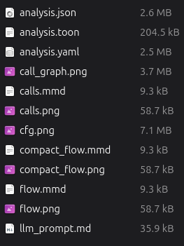

# code2llm

**Python Code Flow Analysis Tool with LLM Integration** - Static analysis for control flow graphs (CFG), data flow graphs (DFG), and call graph extraction with optimized TOON format.



## 🚀 New: TOON Format v2

**TOON v2** is the default output format - scannable, severity-sorted, prompt-ready:

- **🎯 Health-first design** - issues sorted by severity (🔴/🟡)
- **📊 Coupling matrix** - fan-in/fan-out analysis
- **🔍 Duplicate detection** - find identical classes
- **📈 Layered architecture** - package-level metrics
- **⚡ Inline markers** - `!!` (CC≥15), `!` (CC≥10), `×DUP`
- **🚫 Smart filtering** - excludes venv, site-packages
- **📋 Actionable REFACTOR** - concrete steps, not just problems

```bash
# Default: TOON format only
code2llm /path/to/project

# Generate all formats
code2llm /path/to/project -f all

# TOON + YAML (for comparison)
code2llm /path/to/project -f toon,yaml
```

## Performance Optimization

For large projects (>1000 functions), use **Fast Mode**:

```bash
# Ultra-fast analysis (5-10x faster)
code2llm /path/to/project --fast

# Custom performance settings
code2llm /path/to/project \
    --parallel-workers 8 \
    --max-depth 3 \
    --skip-data-flow \
    --cache-dir ./.cache
```

### Performance Tips

| Technique | Speedup | Use Case |
|-----------|---------|----------|
| `--fast` mode | 5-10x | Initial exploration |
| Parallel workers | 2-4x | Multi-core machines |
| Caching | 3-5x | Repeated analysis |
| Depth limiting | 2-3x | Large codebases |
| Skip private methods | 1.5-2x | Public API analysis |

### Benchmarks

| Project Size | Functions | Time (fast) | Time (full) |
|--------------|-----------|-------------|-------------|
| Small (<100) | ~50 | 0.5s | 2s |
| Medium (1K) | ~500 | 3s | 15s |
| Large (10K) | ~2000 | 15s | 120s |

## Features

- **🎯 TOON Format**: Optimized compact output (default)
- **Control Flow Graph (CFG)**: Extract execution paths from Python AST
- **Data Flow Graph (DFG)**: Track variable definitions and dependencies  
- **Call Graph Analysis**: Map function calls and dependencies
- **Pattern Detection**: Identify design patterns and code smells
- **🚀 Streaming Analysis**: Memory-efficient analysis with progress tracking
- **Smart Prioritization**: Analyzes important files first for faster feedback
- **Incremental Analysis**: Detect and analyze only changed files
- **Multiple Output Formats**: TOON, YAML, JSON, Mermaid diagrams, PNG visualizations
- **LLM-Ready Output**: Generate prompts for reverse engineering
- **Smart Validation**: Built-in format validation and testing

## Installation

```bash
# Install from source
pip install -e .

# Or with development dependencies
pip install -e ".[dev]"
```

## Quick Start

```bash
# Analyze a Python project (default: TOON format)
code2llm /path/to/project

# With verbose output
code2llm /path/to/project -v

# Generate all formats
code2llm /path/to/project -f all

# Use different analysis modes
code2llm /path/to/project -m static    # Fast static analysis only
code2llm /path/to/project -m hybrid     # Combined analysis (default)
```

## Usage

### Output Formats

```bash
# Default: TOON format only
code2llm /path/to/project

# All formats (toon,yaml,json,mermaid,png)
code2llm /path/to/project -f all

# Custom combinations
code2llm /path/to/project -f toon,yaml
code2llm /path/to/project -f json,png
code2llm /path/to/project -f mermaid,png
```

### Analysis Modes

```bash
# Static analysis only (fastest)
code2llm /path/to/project -m static

# Dynamic analysis with tracing
code2llm /path/to/project -m dynamic

# Hybrid analysis (recommended)
code2llm /path/to/project -m hybrid

# Behavioral pattern focus
code2llm /path/to/project -m behavioral

# Reverse engineering ready
code2llm /path/to/project -m reverse
```

### 🚀 Streaming Analysis

For large projects, use streaming analysis with smart prioritization:

```bash
# Quick overview (functions/classes only)
code2llm /path/to/project --strategy quick

# Standard analysis with selective CFG
code2llm /path/to/project --strategy standard

# Deep analysis with full CFG
code2llm /path/to/project --strategy deep

# Enable streaming with progress reporting
code2llm /path/to/project --streaming -v

# Memory-limited analysis
code2llm /path/to/project --strategy quick --max-memory 512
```

#### Streaming Strategies

| Strategy | Description | Memory Use | Speed |
|----------|-------------|-----------|-------|
| `quick` | Fast overview - functions/classes only, no CFG | Low | 5-10x |
| `standard` | Balanced analysis with selective CFG | Medium | 2-3x |
| `deep` | Complete analysis with full CFG for all files | High | 1x |

#### Progress Tracking

Streaming analysis provides real-time progress updates:

```bash
# With verbose progress reporting
code2llm /path/to/project --streaming -v

# Output shows:
# [25%] Scanning module.main (priority: 150.0)
# [50%] Building call graph...
# [75%] Deep analysis of important files...
# [100%] Completed in 12.3s
```

### 🔄 Incremental Analysis

For CI/CD and frequent analysis, use incremental mode to analyze only changed files:

```python
from code2llm.core.streaming_analyzer import IncrementalAnalyzer

# Detect changed files since last analysis
incremental = IncrementalAnalyzer()
changed, unchanged = incremental.get_changed_files(".")

# Only analyze changed files for faster CI
if changed:
    print(f"Analyzing {len(changed)} changed files...")
    # Run streaming analysis on changed files only
```

### Custom Output

```bash
code2llm /path/to/project -o my_analysis
```

## Output Files

| File | Format | Description |
|------|--------|-------------|
| `analysis.toon` | TOON | **🎯 Diagnostyka zdrowia** — CC, god modules, COUPLING, LAYERS |
| `evolution.toon` | TOON | **Kolejka refaktoryzacji** — NEXT, RISKS, METRICS-TARGET |
| `flow.toon` | TOON | **Przepływ danych** — PIPELINES, CONTRACTS, SIDE_EFFECTS |
| `project.map` | TOON | **Mapa strukturalna** — moduły, sygnatury, importy |
| `context.md` | Markdown | **Kontekst dla LLM** — architektura, API, flow |
| `analysis.yaml` | YAML | Pełne dane strukturalne |
| `analysis.json` | JSON | Dane maszynowe |
| `flow.mmd` | Mermaid | Diagram z CC-styled nodes |
| `calls.mmd` | Mermaid | Graf wywołań (edges only) |
| `compact_flow.mmd` | Mermaid | Moduły zagregowane |

## 🎯 TOON v2 Format Structure

The TOON v2 format is designed for rapid scanning and actionable insights:

```
# code2llm | 43f 10693L | py:43 | 2026-02-28
# CC̄=4.6 | critical:39/406 | dups:0 | cycles:0

HEALTH[20]:
  🔴 GOD   code2llm/core/analyzer.py = 765L, 4 classes, 30m, max CC=20
  🟡 CC    validate_mermaid_file CC=42 (limit:15)

REFACTOR[4]:
  1. split code2llm/core/analyzer.py  (god module)
  2. split 17 high-CC methods  (CC>15)

COUPLING:
  ┌─────────────┬──────────────────────────────────────┐
  │ Package     │ fan-in  fan-out  status              │
  ├─────────────┼──────────────────────────────────────┤
  │ core        │ 12      45        !! split needed    │
  │ exporters   │ 5       28        hub                │
  └─────────────┴──────────────────────────────────────┘

LAYERS:
  code2llm/                      CC̄=5.0    ←in:0  →out:0
  │ !! toon                       982L  1C   29m  CC=31
  │ !! analyzer                   765L  4C   30m  CC=20

FUNCTIONS (CC≥10, 39 of 406):
   56.0  main                    19n   4exit  cond+ret  !! split
   42.0  validate_mermaid_file   6n   3exit  cond+ret  !! split

HOTSPOTS:
  #1  main                     fan=45   "calls 45 functions"
  #2  analyze_project           fan=18   "analysis pipeline, 18 stages"

CLASSES:
  ToonExporter                   ████████████████████████  29m  CC̄=9.5   max=31    !!
  DataAnalyzer                   ██████████                13m  CC̄=9.9   max=17    !!
```

### Complexity Tiers

- **🔴 Critical** (≥5.0): Immediate refactoring needed
- **🟠 High** (≥3.0): Consider refactoring
- **🟡 Medium** (≥1.5): Monitor complexity
- **🟢 Low** (>0): Acceptable complexity
- **⚪ Basic** (0): Simple functions

## Validation & Testing

Built-in validation ensures output quality:

```bash
# Validate TOON format
python validate_toon.py analysis.toon

# Compare TOON vs YAML
python validate_toon.py analysis.yaml analysis.toon

# Run comprehensive tests
bash project.sh
```

### Test Results

- **✅ Functions**: 100% data consistency (443/443)
- **✅ Statistics**: Perfect correlation
- **✅ Structure**: All required sections present
- **✅ Insights**: Actionable recommendations generated

## Understanding the Output

### LLM Prompt Structure
The generated prompt includes:
- System overview with metrics
- Call graph structure
- Behavioral patterns with confidence scores
- Data flow insights
- State machine definitions
- Reverse engineering guidelines

### Behavioral Patterns
Each pattern includes:
- **Name**: Descriptive identifier
- **Type**: sequential, conditional, iterative, recursive, state_machine
- **Entry/Exit points**: Key functions
- **Decision points**: Conditional logic locations
- **Data transformations**: Variable dependencies
- **Confidence**: Pattern detection certainty

### Reverse Engineering Guidelines
The analysis provides specific guidance for:
1. Preserving call graph structure
2. Implementing identified patterns
3. Maintaining data dependencies
4. Recreating state machines
5. Preserving decision logic

## 📁 Examples

| Example | Description | Use Case |
|---------|-------------|----------|
| [basic-usage](examples/basic-usage/) | Wszystkie komendy CLI | Szybki start |
| [devops-workflow](examples/devops-workflow/) | Bash: metryki w README, commits, hooks | DevOps |
| [ci-cd](examples/ci-cd/) | GitHub Actions, pre-commit, Makefile | Automatyzacja |
| [claude-code](examples/claude-code/) | Automatyczna refaktoryzacja z Claude | AI-assisted |
| [shell-llm](examples/shell-llm/) | aider, llm, sgpt, fabric | Shell LLM |
| [litellm](examples/litellm/) | Python skrypt + dowolny LLM | Programmatic |

### Najczęstsze komendy

```bash
# Szybki health check
code2llm . -f toon -o output/

# Co refaktoryzować najpierw?
code2llm . -f evolution -o output/ --no-png

# Wszystkie formaty
code2llm . -f all -o output/ --no-png

# Benchmark before/after
python benchmarks/benchmark_evolution.py .

# Kontekst do LLM
code2llm . -f context -o output/ && cat output/context.md
```

## Advanced Features

### State Machine Detection
Automatically identifies:
- State variables
- Transition methods
- Source and destination states
- State machine hierarchy

### Data Flow Tracking
Maps:
- Variable dependencies
- Data transformations
- Information flow paths
- Side effects

### Dynamic Tracing
When using dynamic mode:
- Function entry/exit timing
- Call stack reconstruction
- Exception tracking
- Performance profiling

## Integration with LLMs

The generated `llm_prompt.md` is designed to be:
- **Comprehensive**: Contains all necessary system information
- **Structured**: Organized for easy parsing
- **Actionable**: Includes specific implementation guidance
- **Language-agnostic**: Describes behavior, not implementation

Example usage with an LLM:
```
"Based on the TOON analysis provided, implement this system in Go,
preserving all behavioral patterns and data flow characteristics."
```

## Format Comparison

| Feature | TOON | YAML | JSON |
|---------|------|------|------|
| **Size** | 🎯 200KB | 2.5MB | 2.6MB |
| **Readability** | ⭐⭐⭐⭐⭐ | ⭐⭐⭐ | ⭐⭐ |
| **Processing Speed** | ⚡ Fast | 🐌 Slow | 🐌 Slow |
| **Human-Friendly** | ✅ Yes | ❌ No | ❌ No |
| **Machine-Readable** | ✅ Yes | ✅ Yes | ✅ Yes |
| **Insights** | ✅ Built-in | ❌ No | ❌ No |

## Limitations

- Dynamic analysis requires test files
- Complex inheritance hierarchies may need manual review
- External library calls are treated as black boxes
- Runtime reflection and metaprogramming not fully captured

## Contributing

The analyzer is designed to be extensible. Key areas for enhancement:
- Additional pattern types
- Language-specific optimizations
- Improved visualization
- Real-time analysis mode
- TOON format enhancements

## 🎯 Quick Reference

| Command | Output | Use Case |
|---------|--------|----------|
| `code2llm ./project` | `analysis.toon` | Quick analysis (default) |
| `code2llm ./project -f all` | All formats | Complete analysis |
| `code2llm ./project -f toon,yaml` | TOON + YAML | Comparison |
| `code2llm ./project -m hybrid -v` | TOON + verbose | Detailed analysis |
| `python validate_toon.py analysis.toon` | Validation | Quality check |

## 🔧 Advanced Usage

### Custom Analysis Configuration

```bash
# Deep analysis with all insights
code2llm ./project \
    -m hybrid \
    -f toon \
    --max-depth 15 \
    --full \
    -v

# Performance-optimized for large projects
code2llm ./project \
    -m static \
    -f toon \
    --strategy quick \
    --max-memory 500

# Refactoring-focused analysis
code2llm ./project \
    -m behavioral \
    -f toon \
    --refactor \
    --smell god_function
```

### Integration Examples

#### CI/CD Pipeline
```bash
#!/bin/bash
# Analyze code quality in CI
code2llm ./src -f toon -o ./analysis
python validate_toon.py ./analysis/analysis.toon
if [ $? -eq 0 ]; then
    echo "✅ Code analysis passed"
else
    echo "❌ Code analysis failed"
    exit 1
fi
```

#### Pre-commit Hook
```bash
#!/bin/sh
# .git/hooks/pre-commit
code2llm ./ -f toon -o ./temp_analysis
python validate_toon.py ./temp_analysis/analysis.toon
rm -rf ./temp_analysis
```

## 📊 Real-World Examples

### Microservice Analysis
```bash
# Analyze microservice complexity
code2llm ./microservice -f toon -o ./service_analysis
# Results: 15 critical functions, 3 modules need refactoring
```

### Legacy Code Migration
```bash
# Prepare for legacy system migration
code2llm ./legacy -f toon,yaml -o ./migration_analysis
# Use TOON for quick overview, YAML for detailed migration planning
```

### Code Review Enhancement
```bash
# Generate insights for code review
code2llm ./feature-branch -f toon --refactor -o ./review
# Focus on critical functions and code smells
```

## 🚀 Migration Guide

### From YAML to TOON

**Before:**
```bash
code2llm ./project -f yaml -o ./analysis
# Output: analysis.yaml (2.5MB)
```

**After:**
```bash
code2llm ./project -f toon -o ./analysis
# Output: analysis.toon (204KB)
```

**Benefits:**
- 10x smaller files
- Faster processing
- Built-in insights
- Automatic recommendations

### Backward Compatibility

```bash
# Still generate YAML if needed
code2llm ./project -f toon,yaml
# Both formats available for comparison
```

## 📋 TOON Format Specification

### File Structure
```
analysis.toon
├── meta              # Metadata (project, mode, timestamp)
├── stats             # Analysis statistics
├── functions         # Function analysis with complexity
├── classes           # Class information from function grouping
├── modules           # Module-level statistics
├── patterns          # Detected design patterns
├── call_graph        # Top 50 most important functions
└── insights           # Recommendations and summaries
```

### Complexity Scoring

| Factor | Weight | Example |
|--------|--------|---------|
| Loops (FOR/WHILE) | 2.0 | `for i in range(10):` |
| Conditions (IF) | 1.0 | `if condition:` |
| Method calls | 1.0 | `obj.method()` |
| Size (>10 nodes) | 1.0 | Large functions |
| Returns/Assignments | 0.5 | `return value`, `x = 1` |

### Tier Classification

- **Critical (≥5.0)**: Immediate refactoring required
- **High (3.0-4.9)**: Consider refactoring
- **Medium (1.5-2.9)**: Monitor complexity
- **Low (0.1-1.4)**: Acceptable
- **Basic (0.0)**: Simple functions

## 🔍 Troubleshooting

### Common Issues

**Issue:** `analysis.toon not found`
```bash
# Solution: Check output directory
ls -la ./output/
# Should contain analysis.toon file
```

**Issue:** Validation fails
```bash
# Solution: Run with verbose output
code2llm ./project -f toon -v
# Check for any errors during analysis
```

**Issue:** Large file sizes
```bash
# Solution: Use TOON format instead of YAML
code2llm ./project -f toon  # 200KB vs 2.5MB
```

### Performance Issues

**Memory Usage:**
```bash
# Limit memory for large projects
code2llm ./large-project --max-memory 500 -f toon
```

**Slow Analysis:**
```bash
# Use fast mode for initial exploration
code2llm ./project -m static -f toon --strategy quick
```

## 🤝 Contributing to TOON Format

The TOON format is designed to be extensible. Areas for contribution:

- **New complexity metrics**
- **Additional pattern detection**
- **Enhanced recommendations**
- **Visualization improvements**
- **Integration with other tools**

### Development Setup

```bash
# Clone and setup development environment
git clone https://github.com/tom-sapletta/code2llm.git
cd code2llm
pip install -e ".[dev]"

# Run tests
bash project.sh

# Validate TOON format
python validate_toon.py output/analysis.toon
```

## 📚 Additional Resources

- [Examples](examples/) — 6 example projects (CLI, DevOps, CI/CD, LLM integration)
- [Basic Usage](examples/basic-usage/) — Complete CLI reference
- [DevOps Workflow](examples/devops-workflow/) — Metrics in README, commits, hooks
- [CHANGELOG](CHANGELOG.md) — Release history
- [ROADMAP](ROADMAP.md) — Development roadmap
- [TODO](TODO.md) — Task backlog
- [TOON Format Validation](validate_toon.py) — Built-in validation tool
- [Benchmarks](benchmarks/) — Performance and evolution benchmarks

---

**Ready to analyze your code?** Start with the optimized TOON format:

```bash
code2llm ./your-project -f toon
```

## License

Apache License 2.0 - see [LICENSE](LICENSE) for details.

## Author

Created by **Tom Sapletta** - [tom@sapletta.com](mailto:tom@sapletta.com)
