# System Architecture Analysis

## Overview

- **Project**: /home/tom/github/wronai/code2llm
- **Analysis Mode**: hybrid
- **Total Functions**: 467
- **Total Classes**: 82
- **Modules**: 49
- **Entry Points**: 406

## Architecture by Module

### examples.functional_refactoring_example
- **Functions**: 50
- **Classes**: 15
- **File**: `functional_refactoring_example.py`

### code2llm.core.analyzer
- **Functions**: 30
- **Classes**: 4
- **File**: `analyzer.py`

### code2llm.exporters.toon
- **Functions**: 29
- **Classes**: 1
- **File**: `toon.py`

### code2llm.core.streaming_analyzer
- **Functions**: 25
- **Classes**: 6
- **File**: `streaming_analyzer.py`

### code2llm.nlp.pipeline
- **Functions**: 20
- **Classes**: 3
- **File**: `pipeline.py`

### code2llm.exporters.flow_exporter
- **Functions**: 20
- **Classes**: 1
- **File**: `flow_exporter.py`

### code2llm.generators.llm_flow
- **Functions**: 20
- **Classes**: 1
- **File**: `llm_flow.py`

### validate_toon
- **Functions**: 18
- **File**: `validate_toon.py`

### code2llm.analysis.side_effects
- **Functions**: 17
- **Classes**: 2
- **File**: `side_effects.py`

### code2llm.analysis.cfg
- **Functions**: 17
- **Classes**: 1
- **File**: `cfg.py`

### code2llm.nlp.entity_resolution
- **Functions**: 16
- **Classes**: 3
- **File**: `entity_resolution.py`

### code2llm.nlp.intent_matching
- **Functions**: 15
- **Classes**: 3
- **File**: `intent_matching.py`

### code2llm.analysis.pipeline_detector
- **Functions**: 14
- **Classes**: 3
- **File**: `pipeline_detector.py`

### code2llm.analysis.data_analysis
- **Functions**: 13
- **Classes**: 1
- **File**: `data_analysis.py`

### code2llm.analysis.call_graph
- **Functions**: 13
- **Classes**: 1
- **File**: `call_graph.py`

### code2llm.nlp.normalization
- **Functions**: 13
- **Classes**: 2
- **File**: `normalization.py`

### code2llm.analysis.type_inference
- **Functions**: 12
- **Classes**: 1
- **File**: `type_inference.py`

### code2llm.analysis.dfg
- **Functions**: 12
- **Classes**: 1
- **File**: `dfg.py`

### code2llm.exporters.context_exporter
- **Functions**: 12
- **Classes**: 1
- **File**: `context_exporter.py`

### code2llm.exporters.map_exporter
- **Functions**: 10
- **Classes**: 1
- **File**: `map_exporter.py`

## Key Entry Points

Main execution flows into the system:

### code2llm.cli.main
> Main CLI entry point.
- **Calls**: code2llm.cli.create_parser, parser.parse_args, Path, Path, output_dir.mkdir, Config, llm_flow_main, code2llm.cli.generate_llm_context

### benchmarks.benchmark_format_quality.run_benchmark
> Run the full format quality benchmark.
- **Calls**: print, print, print, print, Path, benchmarks.benchmark_format_quality.create_ground_truth_project, print, print

### validate_toon.main
> Main validation function.
- **Calls**: len, Path, print, print, validate_toon.load_file, validate_toon.validate_toon_completeness, print, print

### benchmarks.benchmark_performance.main
> Run benchmark suite.
- **Calls**: print, print, print, print, benchmarks.benchmark_performance.create_test_project, print, print, print

### code2llm.exporters.toon.ToonExporter._compute_file_metrics
> Per-file metrics derived from AnalysisResult.
- **Calls**: result.functions.items, result.classes.items, result.modules.items, defaultdict, result.functions.items, Path, pp.is_dir, self._is_excluded

### code2llm.exporters.toon.ToonExporter.export
> Export analysis result to toon v2 format.
- **Calls**: self._build_context, sections.extend, sections.append, sections.extend, sections.append, sections.extend, sections.append, sections.extend

### code2llm.core.analyzer.ProjectAnalyzer.analyze_project
> Analyze entire project.
- **Calls**: time.time, None.resolve, self._collect_files, self._merge_results, self._build_call_graph, self._perform_refactoring_analysis, project_path.exists, FileNotFoundError

### code2llm.core.analyzer.FileAnalyzer._process_cfg_block
> Process a block of statements for CFG with depth limiting.
- **Calls**: None.append, isinstance, None.append, FlowEdge, FlowNode, func_info.cfg_nodes.append, None.append, self._process_cfg_block

### code2llm.exporters.toon.ToonExporter._render_coupling
- **Calls**: sorted, pkg_activity.sort, max, max, len, lines.append, max, None.join

### code2llm.exporters.map_exporter.MapExporter._render_details
- **Calls**: result.modules.items, mod_items.sort, self._is_excluded, mod_items.append, self._rel_path, lines.append, result.functions.get, None.join

### code2llm.nlp.pipeline.NLPPipeline.process
> Process query through full pipeline (4a-4e).
- **Calls**: time.time, time.time, self._step_normalize, stages.append, time.time, self._step_match_intent, stages.append, time.time

### code2llm.core.analyzer.ProjectAnalyzer._perform_refactoring_analysis
> Perform deep analysis and detect code smells.
- **Calls**: CallGraphExtractor, cg_ext._calculate_metrics, nx.DiGraph, result.functions.items, CouplingAnalyzer, coupling_analyzer.analyze, SmellDetector, smell_detector.detect

### code2llm.core.analyzer.ProjectAnalyzer._detect_dead_code
> Use vulture to find dead code and update reachability.
- **Calls**: print, vulture.Vulture, None.rglob, v.get_unused_code, result.functions.items, print, None.resolve, getattr

### code2llm.refactor.prompt_engine.PromptEngine._build_context_for_smell
> Prepare context data for the Jinja2 template.
- **Calls**: self._get_source_context, self.result.metrics.get, self.result.metrics.get, self._get_instruction_for_smell, None.replace, None.join, None.join, smell.name.split

### code2llm.exporters.toon.ToonExporter._render_details
> Render D: section — per-module details sorted by max CC desc.
- **Calls**: result.modules.items, mod_items.sort, mod_items.append, self._rel_path, lines.append, result.functions.get, None.join, lines.append

### TODO.cli_patch_code2llm.export_dispatch
> Replace the export section in main() with this.
Handles: code2llm ./project -f toon,flow,map
- **Calls**: Path, output.mkdir, format_string.split, set, None.lower, requested.extend, cls, exporter.export

### code2llm.core.streaming_analyzer.StreamingAnalyzer.analyze_streaming
> Analyze project with streaming output (yields partial results).
- **Calls**: time.time, None.resolve, self._collect_files, self.prioritizer.prioritize_files, len, self._report_progress, self._quick_scan_file, self._build_call_graph_streaming

### code2llm.exporters.toon.ToonExporter._detect_duplicates
> Detect duplicate classes by comparing method-name sets.
- **Calls**: enumerate, set, range, result.classes.items, len, len, set, self._is_excluded

### code2llm.exporters.context_exporter.ContextExporter.export
> Generate comprehensive LLM prompt with architecture description.
- **Calls**: lines.extend, lines.extend, self._get_important_entries, lines.extend, lines.extend, lines.extend, lines.extend, lines.extend

### code2llm.exporters.flow_exporter.FlowExporter.export
> Export analysis result to flow.toon format.
- **Calls**: self._build_context, sections.extend, sections.append, sections.extend, sections.append, sections.extend, sections.append, sections.extend

### code2llm.exporters.toon.ToonExporter._render_layers
> Render LAYERS section — files grouped by package with metrics.
- **Calls**: self._dup_file_set, sorted, packages.keys, None.get, None.get, any, lines.append, pkg_files.sort

### code2llm.analysis.data_analysis.DataAnalyzer._analyze_data_types
> Analyze data types and usage.
- **Calls**: result.functions.items, sorted, func.name.lower, self._infer_parameter_types, self._infer_return_types, data_types.values, func.docstring.lower, None.join

### code2llm.nlp.intent_matching.IntentMatcher._calculate_similarity
> Calculate string similarity using configured algorithm.
- **Calls**: None.ratio, None.ratio, a.lower, b.lower, None.ratio, SequenceMatcher, SequenceMatcher, None.join

### code2llm.analysis.pipeline_detector.PipelineDetector._find_pipeline_paths
> Find longest paths in the call graph as pipeline candidates.

Strategy:
1. Find all source nodes (in-degree 0) as potential entry points
2. Find all s
- **Calls**: set, nx.weakly_connected_components, self._longest_path_from, len, graph.subgraph, self._longest_path_in_dag, graph.nodes, sorted

### code2llm.core.streaming_analyzer.StreamingAnalyzer._quick_scan_file
> Quick scan - extract functions and classes only (no CFG).
- **Calls**: content.split, ast.walk, None.read_text, self.cache.get, ModuleInfo, isinstance, ast.parse, ClassInfo

### code2llm.exporters.mermaid_exporter.MermaidExporter.export_call_graph
> Export simplified call graph.
- **Calls**: sorted, result.functions.items, None.parent.mkdir, func_name.split, None.append, modules.items, None.replace, lines.append

### code2llm.core.analyzer.FileAnalyzer._analyze_ast
> Analyze AST and extract structure.
- **Calls**: content.split, ModuleInfo, isinstance, cc_visit, DFGExtractor, dfg_ext.extract, CallGraphExtractor, cg_ext.extract

### code2llm.core.streaming_analyzer.SmartPrioritizer.prioritize_files
> Score and sort files by importance.
- **Calls**: self._build_import_graph, scored.sort, self._check_has_main, len, FilePriority, scored.append, reasons.append, reasons.append

### code2llm.exporters.yaml_exporter.YAMLExporter.export_grouped
> Export with grouped CFG flows by function.
- **Calls**: defaultdict, result.nodes.items, sorted, None.parent.mkdir, func_flows.items, sorted, open, yaml.dump

### code2llm.exporters.flow_exporter.FlowExporter._compute_type_usage
> Count how many functions consume/produce each type using AST data.
- **Calls**: defaultdict, defaultdict, funcs.items, type_list.sort, type_info.get, ti.get, ti.get, set

## Process Flows

Key execution flows identified:

### Flow 1: main
```
main [code2llm.cli]
  └─> create_parser
```

### Flow 2: run_benchmark
```
run_benchmark [benchmarks.benchmark_format_quality]
```

### Flow 3: _compute_file_metrics
```
_compute_file_metrics [code2llm.exporters.toon.ToonExporter]
```

### Flow 4: export
```
export [code2llm.exporters.toon.ToonExporter]
```

### Flow 5: analyze_project
```
analyze_project [code2llm.core.analyzer.ProjectAnalyzer]
```

### Flow 6: _process_cfg_block
```
_process_cfg_block [code2llm.core.analyzer.FileAnalyzer]
```

### Flow 7: _render_coupling
```
_render_coupling [code2llm.exporters.toon.ToonExporter]
```

### Flow 8: _render_details
```
_render_details [code2llm.exporters.map_exporter.MapExporter]
```

### Flow 9: process
```
process [code2llm.nlp.pipeline.NLPPipeline]
```

### Flow 10: _perform_refactoring_analysis
```
_perform_refactoring_analysis [code2llm.core.analyzer.ProjectAnalyzer]
```

## Key Classes

### code2llm.exporters.toon.ToonExporter
> Export to toon v2 plain-text format — scannable, sorted by severity.
- **Methods**: 29
- **Key Methods**: code2llm.exporters.toon.ToonExporter.export, code2llm.exporters.toon.ToonExporter._is_excluded, code2llm.exporters.toon.ToonExporter._build_context, code2llm.exporters.toon.ToonExporter._compute_file_metrics, code2llm.exporters.toon.ToonExporter._compute_package_metrics, code2llm.exporters.toon.ToonExporter._compute_function_metrics, code2llm.exporters.toon.ToonExporter._compute_class_metrics, code2llm.exporters.toon.ToonExporter._compute_coupling_matrix, code2llm.exporters.toon.ToonExporter._detect_duplicates, code2llm.exporters.toon.ToonExporter._compute_health

### code2llm.exporters.flow_exporter.FlowExporter
> Export to flow.toon — data-flow focused format.

Sections: PIPELINES, TRANSFORMS, CONTRACTS, DATA_TY
- **Methods**: 20
- **Key Methods**: code2llm.exporters.flow_exporter.FlowExporter.__init__, code2llm.exporters.flow_exporter.FlowExporter.export, code2llm.exporters.flow_exporter.FlowExporter._build_context, code2llm.exporters.flow_exporter.FlowExporter._pipeline_to_dict, code2llm.exporters.flow_exporter.FlowExporter._compute_transforms, code2llm.exporters.flow_exporter.FlowExporter._transform_label, code2llm.exporters.flow_exporter.FlowExporter._compute_type_usage, code2llm.exporters.flow_exporter.FlowExporter._normalize_type, code2llm.exporters.flow_exporter.FlowExporter._type_label, code2llm.exporters.flow_exporter.FlowExporter._classify_side_effects
- **Inherits**: Exporter

### code2llm.analysis.cfg.CFGExtractor
> Extract Control Flow Graph from AST.
- **Methods**: 17
- **Key Methods**: code2llm.analysis.cfg.CFGExtractor.__init__, code2llm.analysis.cfg.CFGExtractor.extract, code2llm.analysis.cfg.CFGExtractor.new_node, code2llm.analysis.cfg.CFGExtractor.connect, code2llm.analysis.cfg.CFGExtractor.visit_FunctionDef, code2llm.analysis.cfg.CFGExtractor.visit_AsyncFunctionDef, code2llm.analysis.cfg.CFGExtractor.visit_If, code2llm.analysis.cfg.CFGExtractor.visit_For, code2llm.analysis.cfg.CFGExtractor.visit_While, code2llm.analysis.cfg.CFGExtractor.visit_Try
- **Inherits**: ast.NodeVisitor

### code2llm.nlp.pipeline.NLPPipeline
> Main NLP processing pipeline (4a-4e).
- **Methods**: 16
- **Key Methods**: code2llm.nlp.pipeline.NLPPipeline.__init__, code2llm.nlp.pipeline.NLPPipeline.process, code2llm.nlp.pipeline.NLPPipeline._step_normalize, code2llm.nlp.pipeline.NLPPipeline._step_match_intent, code2llm.nlp.pipeline.NLPPipeline._step_resolve_entities, code2llm.nlp.pipeline.NLPPipeline._infer_entity_types, code2llm.nlp.pipeline.NLPPipeline._calculate_overall_confidence, code2llm.nlp.pipeline.NLPPipeline._calculate_entity_confidence, code2llm.nlp.pipeline.NLPPipeline._apply_fallback, code2llm.nlp.pipeline.NLPPipeline._format_action

### code2llm.analysis.side_effects.SideEffectDetector
> Detect side effects in Python functions via AST analysis.

Scans function bodies for IO operations, 
- **Methods**: 15
- **Key Methods**: code2llm.analysis.side_effects.SideEffectDetector.__init__, code2llm.analysis.side_effects.SideEffectDetector.analyze_function, code2llm.analysis.side_effects.SideEffectDetector.analyze_all, code2llm.analysis.side_effects.SideEffectDetector.get_purity_score, code2llm.analysis.side_effects.SideEffectDetector._scan_node, code2llm.analysis.side_effects.SideEffectDetector._check_calls, code2llm.analysis.side_effects.SideEffectDetector._check_assignments, code2llm.analysis.side_effects.SideEffectDetector._check_globals, code2llm.analysis.side_effects.SideEffectDetector._check_yield, code2llm.analysis.side_effects.SideEffectDetector._check_delete

### code2llm.nlp.entity_resolution.EntityResolver
> Resolve entities (functions, classes, etc.) from queries.
- **Methods**: 14
- **Key Methods**: code2llm.nlp.entity_resolution.EntityResolver.__init__, code2llm.nlp.entity_resolution.EntityResolver.resolve, code2llm.nlp.entity_resolution.EntityResolver._extract_candidates, code2llm.nlp.entity_resolution.EntityResolver._extract_from_patterns, code2llm.nlp.entity_resolution.EntityResolver._disambiguate, code2llm.nlp.entity_resolution.EntityResolver._resolve_hierarchical, code2llm.nlp.entity_resolution.EntityResolver._resolve_aliases, code2llm.nlp.entity_resolution.EntityResolver._name_similarity, code2llm.nlp.entity_resolution.EntityResolver.load_from_analysis, code2llm.nlp.entity_resolution.EntityResolver.step_3a_extract_entities

### code2llm.analysis.data_analysis.DataAnalyzer
> Analyze data flows, structures, and optimization opportunities.
- **Methods**: 13
- **Key Methods**: code2llm.analysis.data_analysis.DataAnalyzer.analyze_data_flow, code2llm.analysis.data_analysis.DataAnalyzer.analyze_data_structures, code2llm.analysis.data_analysis.DataAnalyzer._find_data_pipelines, code2llm.analysis.data_analysis.DataAnalyzer._find_state_patterns, code2llm.analysis.data_analysis.DataAnalyzer._find_data_dependencies, code2llm.analysis.data_analysis.DataAnalyzer._find_event_flows, code2llm.analysis.data_analysis.DataAnalyzer._analyze_data_types, code2llm.analysis.data_analysis.DataAnalyzer._infer_parameter_types, code2llm.analysis.data_analysis.DataAnalyzer._infer_return_types, code2llm.analysis.data_analysis.DataAnalyzer._build_data_flow_graph

### code2llm.analysis.pipeline_detector.PipelineDetector
> Detect pipelines in a codebase using networkx graph analysis.

Builds a call graph as a DiGraph, fin
- **Methods**: 13
- **Key Methods**: code2llm.analysis.pipeline_detector.PipelineDetector.__init__, code2llm.analysis.pipeline_detector.PipelineDetector.detect, code2llm.analysis.pipeline_detector.PipelineDetector._build_graph, code2llm.analysis.pipeline_detector.PipelineDetector._find_pipeline_paths, code2llm.analysis.pipeline_detector.PipelineDetector._longest_path_from, code2llm.analysis.pipeline_detector.PipelineDetector._longest_path_in_dag, code2llm.analysis.pipeline_detector.PipelineDetector._build_pipelines, code2llm.analysis.pipeline_detector.PipelineDetector._build_stages, code2llm.analysis.pipeline_detector.PipelineDetector._classify_domain, code2llm.analysis.pipeline_detector.PipelineDetector._derive_pipeline_name

### code2llm.analysis.call_graph.CallGraphExtractor
> Extract call graph from AST.
- **Methods**: 13
- **Key Methods**: code2llm.analysis.call_graph.CallGraphExtractor.__init__, code2llm.analysis.call_graph.CallGraphExtractor.extract, code2llm.analysis.call_graph.CallGraphExtractor._calculate_metrics, code2llm.analysis.call_graph.CallGraphExtractor.visit_Import, code2llm.analysis.call_graph.CallGraphExtractor.visit_ImportFrom, code2llm.analysis.call_graph.CallGraphExtractor.visit_ClassDef, code2llm.analysis.call_graph.CallGraphExtractor.visit_FunctionDef, code2llm.analysis.call_graph.CallGraphExtractor.visit_AsyncFunctionDef, code2llm.analysis.call_graph.CallGraphExtractor.visit_Call, code2llm.analysis.call_graph.CallGraphExtractor._qualified_name
- **Inherits**: ast.NodeVisitor

### code2llm.nlp.intent_matching.IntentMatcher
> Match queries to intents using fuzzy and keyword matching.
- **Methods**: 13
- **Key Methods**: code2llm.nlp.intent_matching.IntentMatcher.__init__, code2llm.nlp.intent_matching.IntentMatcher.match, code2llm.nlp.intent_matching.IntentMatcher._fuzzy_match, code2llm.nlp.intent_matching.IntentMatcher._keyword_match, code2llm.nlp.intent_matching.IntentMatcher._apply_context, code2llm.nlp.intent_matching.IntentMatcher._combine_matches, code2llm.nlp.intent_matching.IntentMatcher._resolve_multi_intent, code2llm.nlp.intent_matching.IntentMatcher._calculate_similarity, code2llm.nlp.intent_matching.IntentMatcher.step_2a_fuzzy_match, code2llm.nlp.intent_matching.IntentMatcher.step_2b_semantic_match

### code2llm.nlp.normalization.QueryNormalizer
> Normalize queries for consistent processing.
- **Methods**: 13
- **Key Methods**: code2llm.nlp.normalization.QueryNormalizer.__init__, code2llm.nlp.normalization.QueryNormalizer.normalize, code2llm.nlp.normalization.QueryNormalizer._unicode_normalize, code2llm.nlp.normalization.QueryNormalizer._lowercase, code2llm.nlp.normalization.QueryNormalizer._remove_punctuation, code2llm.nlp.normalization.QueryNormalizer._normalize_whitespace, code2llm.nlp.normalization.QueryNormalizer._remove_stopwords, code2llm.nlp.normalization.QueryNormalizer._tokenize, code2llm.nlp.normalization.QueryNormalizer.step_1a_lowercase, code2llm.nlp.normalization.QueryNormalizer.step_1b_remove_punctuation

### code2llm.analysis.type_inference.TypeInferenceEngine
> Extract and infer type information from Python source files.

Operates on source files referenced by
- **Methods**: 12
- **Key Methods**: code2llm.analysis.type_inference.TypeInferenceEngine.__init__, code2llm.analysis.type_inference.TypeInferenceEngine.enrich_function, code2llm.analysis.type_inference.TypeInferenceEngine.get_arg_types, code2llm.analysis.type_inference.TypeInferenceEngine.get_return_type, code2llm.analysis.type_inference.TypeInferenceEngine.get_typed_signature, code2llm.analysis.type_inference.TypeInferenceEngine.extract_all_types, code2llm.analysis.type_inference.TypeInferenceEngine._get_ast, code2llm.analysis.type_inference.TypeInferenceEngine._find_function_node, code2llm.analysis.type_inference.TypeInferenceEngine._extract_from_node, code2llm.analysis.type_inference.TypeInferenceEngine._extract_args

### code2llm.analysis.dfg.DFGExtractor
> Extract Data Flow Graph from AST.
- **Methods**: 12
- **Key Methods**: code2llm.analysis.dfg.DFGExtractor.__init__, code2llm.analysis.dfg.DFGExtractor.extract, code2llm.analysis.dfg.DFGExtractor.visit_FunctionDef, code2llm.analysis.dfg.DFGExtractor.visit_Assign, code2llm.analysis.dfg.DFGExtractor.visit_AugAssign, code2llm.analysis.dfg.DFGExtractor.visit_For, code2llm.analysis.dfg.DFGExtractor.visit_Call, code2llm.analysis.dfg.DFGExtractor._extract_targets, code2llm.analysis.dfg.DFGExtractor._get_names, code2llm.analysis.dfg.DFGExtractor._extract_names
- **Inherits**: ast.NodeVisitor

### code2llm.exporters.context_exporter.ContextExporter
> Export LLM-ready analysis summary with architecture and flows.

Output: context.md — architecture na
- **Methods**: 12
- **Key Methods**: code2llm.exporters.context_exporter.ContextExporter.export, code2llm.exporters.context_exporter.ContextExporter._get_overview, code2llm.exporters.context_exporter.ContextExporter._get_architecture_by_module, code2llm.exporters.context_exporter.ContextExporter._get_important_entries, code2llm.exporters.context_exporter.ContextExporter._get_key_entry_points, code2llm.exporters.context_exporter.ContextExporter._get_process_flows, code2llm.exporters.context_exporter.ContextExporter._get_key_classes, code2llm.exporters.context_exporter.ContextExporter._get_data_transformations, code2llm.exporters.context_exporter.ContextExporter._get_behavioral_patterns, code2llm.exporters.context_exporter.ContextExporter._get_api_surface
- **Inherits**: Exporter

### code2llm.core.streaming_analyzer.StreamingAnalyzer
> Memory-efficient streaming analyzer with progress tracking.
- **Methods**: 11
- **Key Methods**: code2llm.core.streaming_analyzer.StreamingAnalyzer.__init__, code2llm.core.streaming_analyzer.StreamingAnalyzer.set_progress_callback, code2llm.core.streaming_analyzer.StreamingAnalyzer.cancel, code2llm.core.streaming_analyzer.StreamingAnalyzer.analyze_streaming, code2llm.core.streaming_analyzer.StreamingAnalyzer._quick_scan_file, code2llm.core.streaming_analyzer.StreamingAnalyzer._deep_analyze_file, code2llm.core.streaming_analyzer.StreamingAnalyzer._build_call_graph_streaming, code2llm.core.streaming_analyzer.StreamingAnalyzer._select_important_files, code2llm.core.streaming_analyzer.StreamingAnalyzer._collect_files, code2llm.core.streaming_analyzer.StreamingAnalyzer._estimate_eta

### examples.functional_refactoring_example.EvolutionaryCache
> Cache that evolves based on usage patterns.

Unlike simple LRU cache, this tracks success/failure ra
- **Methods**: 10
- **Key Methods**: examples.functional_refactoring_example.EvolutionaryCache.__init__, examples.functional_refactoring_example.EvolutionaryCache._load, examples.functional_refactoring_example.EvolutionaryCache._save, examples.functional_refactoring_example.EvolutionaryCache.get, examples.functional_refactoring_example.EvolutionaryCache.put, examples.functional_refactoring_example.EvolutionaryCache.report_success, examples.functional_refactoring_example.EvolutionaryCache.report_failure, examples.functional_refactoring_example.EvolutionaryCache._make_key, examples.functional_refactoring_example.EvolutionaryCache._calculate_score, examples.functional_refactoring_example.EvolutionaryCache._evict_worst

### code2llm.exporters.map_exporter.MapExporter
> Export to map.toon — structural map with modules, imports, signatures.

Keys: M=modules, D=details, 
- **Methods**: 10
- **Key Methods**: code2llm.exporters.map_exporter.MapExporter.export, code2llm.exporters.map_exporter.MapExporter._render_header, code2llm.exporters.map_exporter.MapExporter._render_module_list, code2llm.exporters.map_exporter.MapExporter._render_details, code2llm.exporters.map_exporter.MapExporter._function_signature, code2llm.exporters.map_exporter.MapExporter._is_excluded, code2llm.exporters.map_exporter.MapExporter._rel_path, code2llm.exporters.map_exporter.MapExporter._file_line_count, code2llm.exporters.map_exporter.MapExporter._count_total_lines, code2llm.exporters.map_exporter.MapExporter._detect_languages
- **Inherits**: Exporter

### code2llm.core.analyzer.FileAnalyzer
> Analyzes a single file.
- **Methods**: 10
- **Key Methods**: code2llm.core.analyzer.FileAnalyzer.__init__, code2llm.core.analyzer.FileAnalyzer.analyze_file, code2llm.core.analyzer.FileAnalyzer._analyze_ast, code2llm.core.analyzer.FileAnalyzer._process_class, code2llm.core.analyzer.FileAnalyzer._process_function, code2llm.core.analyzer.FileAnalyzer._build_cfg, code2llm.core.analyzer.FileAnalyzer._process_cfg_block, code2llm.core.analyzer.FileAnalyzer._get_base_name, code2llm.core.analyzer.FileAnalyzer._get_decorator_name, code2llm.core.analyzer.FileAnalyzer._get_call_name

### code2llm.core.analyzer.ProjectAnalyzer
> Main analyzer with parallel processing.
- **Methods**: 10
- **Key Methods**: code2llm.core.analyzer.ProjectAnalyzer.__init__, code2llm.core.analyzer.ProjectAnalyzer.analyze_project, code2llm.core.analyzer.ProjectAnalyzer._collect_files, code2llm.core.analyzer.ProjectAnalyzer._analyze_parallel, code2llm.core.analyzer.ProjectAnalyzer._analyze_sequential, code2llm.core.analyzer.ProjectAnalyzer._merge_results, code2llm.core.analyzer.ProjectAnalyzer._build_call_graph, code2llm.core.analyzer.ProjectAnalyzer._detect_patterns, code2llm.core.analyzer.ProjectAnalyzer._perform_refactoring_analysis, code2llm.core.analyzer.ProjectAnalyzer._detect_dead_code

### examples.functional_refactoring_example.TemplateGenerator
> Original - handles EVERYTHING: loading, matching, rendering, shell, docker, sql...
- **Methods**: 9
- **Key Methods**: examples.functional_refactoring_example.TemplateGenerator.__init__, examples.functional_refactoring_example.TemplateGenerator.generate, examples.functional_refactoring_example.TemplateGenerator._prepare_shell_entities, examples.functional_refactoring_example.TemplateGenerator._prepare_docker_entities, examples.functional_refactoring_example.TemplateGenerator._prepare_sql_entities, examples.functional_refactoring_example.TemplateGenerator._prepare_kubernetes_entities, examples.functional_refactoring_example.TemplateGenerator._apply_shell_find_flags, examples.functional_refactoring_example.TemplateGenerator._build_shell_find_name_flag, examples.functional_refactoring_example.TemplateGenerator._build_shell_find_size_flag

## Data Transformation Functions

Key functions that process and transform data:

### validate_toon.parse_toon_content
> Parse TOON v2 plain-text format.
- **Output to**: content.split, line.strip, line.startswith, line.startswith, line.startswith

### validate_toon.validate_toon_completeness
> Validate toon format structure.
- **Output to**: print, print, bool, bool, bool

### TODO.cli_patch_code2llm.create_parser_patch
> Add to create_parser() in cli.py.
- **Output to**: FORMAT_REGISTRY.items

### scripts.bump_version.parse_version
> Parse version string into tuple of (major, minor, patch)
- **Output to**: version_str.split, tuple, int

### scripts.bump_version.format_version
> Format version tuple as string

### code2llm.analysis.data_analysis.DataAnalyzer._identify_process_patterns
- **Output to**: result.functions.items, patterns.items, sorted, func.name.lower, indicators.items

### benchmarks.benchmark_format_quality.evaluate_format
> Evaluate a single format against ground truth.
- **Output to**: FormatScore, content.lower, sum, KNOWN_PIPELINES.items, sum

### code2llm.cli.create_parser
> Create CLI argument parser.
- **Output to**: argparse.ArgumentParser, parser.add_argument, parser.add_argument, parser.add_argument, parser.add_argument

### code2llm.analysis.cfg.CFGExtractor._format_except
> Format except handler.
- **Output to**: self._expr_to_str

### code2llm.nlp.pipeline.NLPPipeline.process
> Process query through full pipeline (4a-4e).
- **Output to**: time.time, time.time, self._step_normalize, stages.append, time.time

### code2llm.nlp.pipeline.NLPPipeline._format_action
> 4e. Format action recommendation.
- **Output to**: result.get_intent, result.get_entities

### code2llm.nlp.pipeline.NLPPipeline._format_response
> 4e. Format human-readable response.
- **Output to**: None.join, lines.append, lines.append, lines.append, result.get_intent

### code2llm.nlp.pipeline.NLPPipeline.step_4e_format
> Step 4e: Output formatting.
- **Output to**: self._format_response

### code2llm.exporters.context_exporter.ContextExporter._get_process_flows
- **Output to**: set, set, seen_base_names.add, self._trace_flow, ep_name.split

### code2llm.exporters.context_exporter.ContextExporter._get_data_transformations
- **Output to**: lines.append, lines.append, result.functions.items, any, lines.append

### code2llm.exporters.flow_exporter.FlowExporter._compute_transforms
> Find functions with fan-out >= threshold.
- **Output to**: funcs.items, transforms.sort, len, set, transforms.append

### code2llm.exporters.flow_exporter.FlowExporter._transform_label

### code2llm.exporters.flow_exporter.FlowExporter._render_transforms
- **Output to**: lines.append

### code2llm.generators.llm_flow._parse_call_label
- **Output to**: None.strip, None.strip, None.replace, re.match, re.match

### code2llm.generators.llm_flow._parse_func_label
- **Output to**: None.strip, label.startswith, None.strip, len

### code2llm.generators.llm_flow.create_parser
- **Output to**: argparse.ArgumentParser, p.add_argument, p.add_argument, p.add_argument, p.add_argument

### code2llm.generators.llm_task._parse_bullets
- **Output to**: raw.strip, s.startswith, items.append, items.append, None.strip

### code2llm.generators.llm_task.parse_llm_task_text
- **Output to**: code2llm.generators.llm_flow._strip_bom, None.split, _SECTION_KEYS.items, sections.get, sections.get

### code2llm.generators.llm_task.create_parser
- **Output to**: argparse.ArgumentParser, p.add_argument, p.add_argument, p.add_argument

### code2llm.core.analyzer.FastFileFilter.should_process
> Check if file should be processed.
- **Output to**: file_path.lower, any, fnmatch.fnmatch, fnmatch.fnmatch

## Behavioral Patterns

### state_machine_IncrementalAnalyzer
- **Type**: state_machine
- **Confidence**: 0.70
- **Functions**: code2llm.core.streaming_analyzer.IncrementalAnalyzer.__init__, code2llm.core.streaming_analyzer.IncrementalAnalyzer._load_state, code2llm.core.streaming_analyzer.IncrementalAnalyzer._save_state, code2llm.core.streaming_analyzer.IncrementalAnalyzer.get_changed_files, code2llm.core.streaming_analyzer.IncrementalAnalyzer._get_module_name

## Public API Surface

Functions exposed as public API (no underscore prefix):

- `code2llm.cli.main` - 123 calls
- `code2llm.generators.mermaid.fix_mermaid_file` - 55 calls
- `benchmarks.benchmark_format_quality.evaluate_format` - 53 calls
- `benchmarks.benchmark_format_quality.run_benchmark` - 47 calls
- `benchmarks.benchmark_format_quality.print_results` - 46 calls
- `validate_toon.main` - 45 calls
- `code2llm.generators.llm_task.normalize_llm_task` - 43 calls
- `code2llm.generators.llm_flow.render_llm_flow_md` - 42 calls
- `benchmarks.benchmark_performance.main` - 41 calls
- `validate_toon.analyze_class_differences` - 39 calls
- `code2llm.generators.mermaid.validate_mermaid_file` - 38 calls
- `validate_toon.parse_toon_content` - 37 calls
- `code2llm.exporters.toon.ToonExporter.export` - 35 calls
- `code2llm.core.analyzer.ProjectAnalyzer.analyze_project` - 35 calls
- `code2llm.generators.llm_task.parse_llm_task_text` - 32 calls
- `benchmarks.benchmark_performance.create_test_project` - 29 calls
- `code2llm.nlp.pipeline.NLPPipeline.process` - 29 calls
- `validate_toon.compare_modules` - 26 calls
- `TODO.cli_patch_code2llm.export_dispatch` - 26 calls
- `code2llm.core.streaming_analyzer.StreamingAnalyzer.analyze_streaming` - 26 calls
- `code2llm.exporters.context_exporter.ContextExporter.export` - 25 calls
- `validate_toon.compare_functions` - 24 calls
- `code2llm.generators.mermaid.generate_single_png` - 24 calls
- `code2llm.cli.create_parser` - 23 calls
- `code2llm.exporters.flow_exporter.FlowExporter.export` - 23 calls
- `code2llm.cli.generate_llm_context` - 21 calls
- `code2llm.exporters.mermaid_exporter.MermaidExporter.export_call_graph` - 20 calls
- `validate_toon.compare_classes` - 19 calls
- `code2llm.core.streaming_analyzer.SmartPrioritizer.prioritize_files` - 19 calls
- `code2llm.exporters.yaml_exporter.YAMLExporter.export_grouped` - 19 calls
- `code2llm.generators.llm_flow.main` - 18 calls
- `validate_toon.validate_toon_completeness` - 17 calls
- `examples.functional_refactoring_example.generate` - 16 calls
- `code2llm.nlp.config.NLPConfig.from_yaml` - 15 calls
- `benchmarks.benchmark_performance.benchmark_original_analyzer` - 14 calls
- `code2llm.analysis.smells.SmellDetector.detect` - 14 calls
- `code2llm.generators.llm_task.main` - 13 calls
- `benchmarks.benchmark_performance.benchmark_streaming_analyzer` - 12 calls
- `benchmarks.benchmark_format_quality.create_ground_truth_project` - 12 calls
- `code2llm.analysis.dfg.DFGExtractor.visit_Call` - 12 calls

## System Interactions

How components interact:

```mermaid
graph TD
    main --> create_parser
    main --> parse_args
    main --> Path
    main --> mkdir
    run_benchmark --> print
    run_benchmark --> Path
    main --> len
    main --> print
    main --> load_file
    main --> create_test_project
    _compute_file_metric --> items
    _compute_file_metric --> defaultdict
    export --> _build_context
    export --> extend
    export --> append
    analyze_project --> time
    analyze_project --> resolve
    analyze_project --> _collect_files
    analyze_project --> _merge_results
    analyze_project --> _build_call_graph
    _process_cfg_block --> append
    _process_cfg_block --> isinstance
    _process_cfg_block --> FlowEdge
    _process_cfg_block --> FlowNode
    _render_coupling --> sorted
    _render_coupling --> sort
    _render_coupling --> max
    _render_coupling --> len
    _render_details --> items
    _render_details --> sort
```



## Reverse Engineering Guidelines

1. **Entry Points**: Start analysis from the entry points listed above
2. **Core Logic**: Focus on classes with many methods
3. **Data Flow**: Follow data transformation functions
4. **Process Flows**: Use the flow diagrams for execution paths
5. **API Surface**: Public API functions reveal the interface

## Context for LLM

Maintain the identified architectural patterns and public API surface when suggesting changes.