# System Architecture Analysis
<!-- generated in 0.01s -->

## Overview

- **Project**: /home/tom/github/semcod/code2llm
- **Primary Language**: python
- **Languages**: python: 189, yaml: 38, txt: 7, shell: 4, yml: 3
- **Analysis Mode**: static
- **Total Functions**: 2238
- **Total Classes**: 141
- **Modules**: 255
- **Entry Points**: 1814

## Architecture by Module

### map.toon
- **Functions**: 23564
- **File**: `map.toon.yaml`

### project.map.toon
- **Functions**: 525
- **File**: `map.toon.yaml`

### code2llm.analysis.data_analysis
- **Functions**: 28
- **Classes**: 3
- **File**: `data_analysis.py`

### code2llm.exporters.toon.renderer
- **Functions**: 26
- **Classes**: 1
- **File**: `renderer.py`

### code2llm.exporters.yaml_exporter
- **Functions**: 25
- **Classes**: 1
- **File**: `yaml_exporter.py`

### code2llm.core.analyzer
- **Functions**: 22
- **Classes**: 1
- **File**: `analyzer.py`

### code2llm.core.persistent_cache
- **Functions**: 22
- **Classes**: 1
- **File**: `persistent_cache.py`

### validate_toon
- **Functions**: 21
- **File**: `validate_toon.py`

### code2llm.core.large_repo
- **Functions**: 20
- **Classes**: 2
- **File**: `large_repo.py`

### code2llm.nlp.pipeline
- **Functions**: 20
- **Classes**: 3
- **File**: `pipeline.py`

### examples.functional_refactoring.entity_preparers
- **Functions**: 18
- **Classes**: 6
- **File**: `entity_preparers.py`

### code2llm.core.file_analyzer
- **Functions**: 18
- **Classes**: 1
- **File**: `file_analyzer.py`

### code2llm.cli_exports.prompt
- **Functions**: 18
- **File**: `prompt.py`

### code2llm.analysis.type_inference
- **Functions**: 17
- **Classes**: 1
- **File**: `type_inference.py`

### code2llm.analysis.cfg
- **Functions**: 16
- **Classes**: 1
- **File**: `cfg.py`

### code2llm.nlp.entity_resolution
- **Functions**: 16
- **Classes**: 3
- **File**: `entity_resolution.py`

### code2llm.generators.llm_task
- **Functions**: 16
- **File**: `llm_task.py`

### code2llm.cli_exports.formats
- **Functions**: 16
- **File**: `formats.py`

### code2llm.analysis.side_effects
- **Functions**: 15
- **Classes**: 2
- **File**: `side_effects.py`

### code2llm.nlp.intent_matching
- **Functions**: 15
- **Classes**: 3
- **File**: `intent_matching.py`

## Key Entry Points

Main execution flows into the system:

### pipeline.run_pipeline
> Run unified pipeline in single process.

Returns dict with timings and status for each stage.
- **Calls**: None.resolve, None.resolve, out_path.mkdir, time.perf_counter, Taskfile.print, Taskfile.print, Taskfile.print, Taskfile.print

### code2llm.cli_parser.create_parser
> Create CLI argument parser.
- **Calls**: argparse.ArgumentParser, parser.add_argument, parser.add_argument, parser.add_argument, parser.add_argument, parser.add_argument, parser.add_argument, parser.add_argument

### code2llm.generators.llm_flow.generator.render_llm_flow_md
- **Calls**: map.toon._as_dict, map.toon._as_list, map.toon._as_list, lines.append, lines.append, map.toon._as_list, lines.append, flow.get

### benchmarks.benchmark_performance.main
> Run benchmark suite.
- **Calls**: Taskfile.print, Taskfile.print, Taskfile.print, Taskfile.print, benchmarks.benchmark_performance.create_test_project, Taskfile.print, Taskfile.print, Taskfile.print

### code2llm.generators.llm_flow.analysis._summarize_functions
> Summarize functions with their decisions, calls, and location info.
- **Calls**: defaultdict, defaultdict, nodes.values, set, n.get, n.get, str, loc_by_func.get

### benchmarks.benchmark_evolution.run_benchmark
> Run evolution analysis and print before/after table.
- **Calls**: benchmarks.benchmark_evolution.load_previous, Taskfile.print, Taskfile.print, Taskfile.print, Taskfile.print, Taskfile.print, metrics_labels.items, Taskfile.print

### code2llm.core.lang.rust.analyze_rust
> Analyze Rust files using regex-based parsing.
- **Calls**: content.split, re.compile, re.compile, re.compile, re.compile, re.compile, enumerate, map.toon.calculate_complexity_regex

### code2llm.cli_exports.orchestrator_handlers._export_mermaid
> Export mermaid diagrams.
- **Calls**: MermaidExporter, getattr, time.monotonic, exporter.export_flow_compact, exporter.export_call_graph, exporter.export_compact, getattr, getattr

### code2llm.nlp.pipeline.NLPPipeline.process
> Process query through full pipeline (4a-4e).
- **Calls**: time.time, time.time, self._step_normalize, stages.append, time.time, self._step_match_intent, stages.append, time.time

### code2llm.refactor.prompt_engine.PromptEngine._build_context_for_smell
> Prepare context data for the Jinja2 template.
- **Calls**: self._get_source_context, self.result.metrics.get, self.result.metrics.get, self._get_instruction_for_smell, None.replace, None.join, None.join, smell.name.split

### code2llm.exporters.context_view.ContextViewGenerator._render_architecture
- **Calls**: sorted, m.get, None.append, dir_groups.keys, sum, sum, lines.append, lines.append

### code2llm.exporters.mermaid.compact.export_compact
> Export module-level graph: one node per module, weighted edges.
- **Calls**: map.toon.build_name_index, defaultdict, defaultdict, result.functions.items, defaultdict, result.functions.items, set, sorted

### code2llm.cli_exports.formats._export_simple_formats
> Export toon, map, flow, context, yaml, json, project-yaml formats.
- **Calls**: format_map.items, code2llm.cli_exports.formats._export_project_yaml, map.toon.load_project_yaml, view_map.items, map.toon.validate_project_yaml, code2llm.cli_exports.formats._export_yaml, JSONExporter, exporter.export

### code2llm.cli_exports.formats._export_mermaid
> Export Mermaid diagrams + optional PNG generation.

Plan R1: 3-level flow diagrams
- flow.mmd (compact, ~50 nodes) - architectural view [default]
- fl
- **Calls**: MermaidExporter, getattr, exporter.export_flow_compact, getattr, getattr, exporter.export_call_graph, exporter.export_compact, YAMLExporter

### code2llm.core.streaming_analyzer.StreamingAnalyzer.analyze_streaming
> Analyze project with streaming output (yields partial results).
- **Calls**: time.time, None.resolve, self.scanner.collect_files, self.prioritizer.prioritize_files, len, self._report_progress, self.scanner.quick_scan_file, self.scanner.build_call_graph_streaming

### code2llm.exporters.mermaid.calls.export_calls
> Export simplified call graph — only connected nodes.
- **Calls**: map.toon.build_name_index, set, result.functions.items, sorted, set, map.toon.write_file, map.toon.module_of, result.functions.get

### code2llm.cli_exports.orchestrator._run_exports
> Export analysis results in requested formats.

Uses EXPORT_REGISTRY for core format dispatch.
For chunked analysis, exports to subproject subdirectori
- **Calls**: code2llm.cli_exports.orchestrator._expand_all_formats, getattr, getattr, f.strip, getattr, code2llm.cli_exports.orchestrator._show_dry_run_plan, getattr, PersistentCache

### code2llm.exporters.toon.ToonExporter.export
> Export analysis result to toon v2 format.
- **Calls**: self.metrics_computer.compute_all_metrics, sections.extend, sections.append, sections.extend, sections.append, sections.extend, sections.append, sections.extend

### code2llm.exporters.toon.metrics_core.CoreMetricsComputer.compute_file_metrics
> Per-file metrics derived from AnalysisResult.
- **Calls**: result.functions.items, result.classes.items, result.modules.items, self._compute_fan_in, code2llm.exporters.evolution_exporter.EvolutionExporter._is_excluded, fi.complexity.get, None.append, max

### code2llm.exporters.project_yaml.core.ProjectYAMLExporter._build_project_yaml
> Build complete project.yaml structure.
- **Calls**: map.toon._scan_line_counts, map.toon.build_modules, map.toon.build_health, map.toon.build_hotspots, map.toon.build_refactoring, map.toon.build_evolution, sum, line_counts.items

### code2llm.exporters.context_exporter.ContextExporter.export
> Generate comprehensive LLM prompt with architecture description.
- **Calls**: lines.extend, lines.extend, self._get_important_entries, lines.extend, lines.extend, lines.extend, lines.extend, lines.extend

### code2llm.exporters.toon_view.ToonViewGenerator._render_modules
- **Calls**: defaultdict, sorted, m.get, None.suffix.lower, _LANG_EXT_MAP.get, lines.append, None.suffix.lower, _LANG_EXT_MAP.get

### code2llm.exporters.toon.helpers._scan_line_counts
> Get line counts for project files.

Fast path: derive from AnalysisResult modules (already parsed, no extra I/O).
Slow fallback: single os.walk pass r
- **Calls**: Path, set, pp.is_dir, None.items, hasattr, None.walk, code2llm.exporters.toon.helpers._walk_compat, getattr

### code2llm.exporters.evolution.yaml_export.export_to_yaml
> Generate evolution.toon.yaml (structured YAML).
- **Calls**: map.toon.build_context, actions.sort, None.parent.mkdir, actions.append, risks.append, None.strftime, open, yaml.dump

### scripts.benchmark_badges.main
> Main function to generate badges.
- **Calls**: Path, output_dir.mkdir, os.walk, None.glob, None.glob, scripts.benchmark_badges.create_html, output_path.write_text, Taskfile.print

### benchmarks.format_evaluator.evaluate_format
> Oceń pojedynczy format względem ground truth.
- **Calls**: FormatScore, benchmarks.format_evaluator._detect_problems, sum, benchmarks.format_evaluator._detect_pipelines, sum, benchmarks.format_evaluator._detect_hub_types, sum, benchmarks.format_evaluator._check_structural_features

### benchmarks.benchmark_format_quality.run_benchmark
> Run the full format quality benchmark.
- **Calls**: benchmarks.benchmark_format_quality._print_benchmark_header, Path, map.toon.create_ground_truth_project, benchmarks.benchmark_format_quality._print_ground_truth_info, output_dir.mkdir, map.toon.print_results, map.toon.build_report, tempfile.mkdtemp

### code2llm.core.analyzer.ProjectAnalyzer.analyze_project
> Analyze entire project.
- **Calls**: time.time, self._resolve_project_path, self._collect_files, self._load_from_persistent_cache, self._run_analysis, self._store_to_persistent_cache, self._merge_results, self._post_process

### code2llm.nlp.intent_matching.IntentMatcher._calculate_similarity
> Calculate string similarity using configured algorithm.
- **Calls**: None.ratio, None.ratio, a.lower, b.lower, None.ratio, SequenceMatcher, SequenceMatcher, None.join

### code2llm.exporters.evolution_exporter.EvolutionExporter.export
> Generate evolution.toon.
- **Calls**: map.toon.build_context, sections.extend, sections.append, sections.extend, sections.append, sections.extend, sections.append, sections.extend

## Process Flows

Key execution flows identified:

### Flow 1: run_pipeline
```
run_pipeline [pipeline]
  └─ →> print
```

### Flow 2: create_parser
```
create_parser [code2llm.cli_parser]
```

### Flow 3: render_llm_flow_md
```
render_llm_flow_md [code2llm.generators.llm_flow.generator]
  └─ →> _as_dict
  └─ →> _as_list
```

### Flow 4: main
```
main [benchmarks.benchmark_performance]
  └─> create_test_project
  └─ →> print
  └─ →> print
```

### Flow 5: _summarize_functions
```
_summarize_functions [code2llm.generators.llm_flow.analysis]
```

### Flow 6: run_benchmark
```
run_benchmark [benchmarks.benchmark_evolution]
  └─> load_previous
  └─ →> print
  └─ →> print
```

### Flow 7: analyze_rust
```
analyze_rust [code2llm.core.lang.rust]
```

### Flow 8: _export_mermaid
```
_export_mermaid [code2llm.cli_exports.orchestrator_handlers]
```

### Flow 9: process
```
process [code2llm.nlp.pipeline.NLPPipeline]
```

### Flow 10: _build_context_for_smell
```
_build_context_for_smell [code2llm.refactor.prompt_engine.PromptEngine]
```

## Key Classes

### code2llm.exporters.toon.renderer.ToonRenderer
> Renders all sections for TOON export.
- **Methods**: 26
- **Key Methods**: code2llm.exporters.toon.renderer.ToonRenderer.render_header, code2llm.exporters.toon.renderer.ToonRenderer._detect_language_label, code2llm.exporters.toon.renderer.ToonRenderer.render_health, code2llm.exporters.toon.renderer.ToonRenderer.render_refactor, code2llm.exporters.toon.renderer.ToonRenderer.render_coupling, code2llm.exporters.toon.renderer.ToonRenderer._select_top_packages, code2llm.exporters.toon.renderer.ToonRenderer._render_coupling_header, code2llm.exporters.toon.renderer.ToonRenderer._render_coupling_rows, code2llm.exporters.toon.renderer.ToonRenderer._build_coupling_row, code2llm.exporters.toon.renderer.ToonRenderer._coupling_row_tag

### code2llm.exporters.yaml_exporter.YAMLExporter
> Export to YAML format.
- **Methods**: 25
- **Key Methods**: code2llm.exporters.yaml_exporter.YAMLExporter.__init__, code2llm.exporters.yaml_exporter.YAMLExporter._get_name_index, code2llm.exporters.yaml_exporter.YAMLExporter.export, code2llm.exporters.yaml_exporter.YAMLExporter.export_grouped, code2llm.exporters.yaml_exporter.YAMLExporter.export_data_flow, code2llm.exporters.yaml_exporter.YAMLExporter.export_data_structures, code2llm.exporters.yaml_exporter.YAMLExporter.export_separated, code2llm.exporters.yaml_exporter.YAMLExporter.export_split, code2llm.exporters.yaml_exporter.YAMLExporter.export_calls, code2llm.exporters.yaml_exporter.YAMLExporter._collect_edges
- **Inherits**: BaseExporter

### code2llm.core.analyzer.ProjectAnalyzer
> Main analyzer with parallel processing.
- **Methods**: 22
- **Key Methods**: code2llm.core.analyzer.ProjectAnalyzer.__init__, code2llm.core.analyzer.ProjectAnalyzer.analyze_project, code2llm.core.analyzer.ProjectAnalyzer._resolve_project_path, code2llm.core.analyzer.ProjectAnalyzer._load_from_persistent_cache, code2llm.core.analyzer.ProjectAnalyzer._run_analysis, code2llm.core.analyzer.ProjectAnalyzer._store_to_persistent_cache, code2llm.core.analyzer.ProjectAnalyzer._build_stats, code2llm.core.analyzer.ProjectAnalyzer._print_summary, code2llm.core.analyzer.ProjectAnalyzer._post_process, code2llm.core.analyzer.ProjectAnalyzer._should_collect_file

### code2llm.core.large_repo.HierarchicalRepoSplitter
> Splits large repositories using hierarchical approach.

Strategy:
1. First pass: level 1 folders
2. 
- **Methods**: 18
- **Key Methods**: code2llm.core.large_repo.HierarchicalRepoSplitter.__init__, code2llm.core.large_repo.HierarchicalRepoSplitter.get_analysis_plan, code2llm.core.large_repo.HierarchicalRepoSplitter._split_hierarchically, code2llm.core.large_repo.HierarchicalRepoSplitter._merge_small_l1_dirs, code2llm.core.large_repo.HierarchicalRepoSplitter._split_level2_consolidated, code2llm.core.large_repo.HierarchicalRepoSplitter._categorize_subdirs, code2llm.core.large_repo.HierarchicalRepoSplitter._process_large_dirs, code2llm.core.large_repo.HierarchicalRepoSplitter._process_level1_files, code2llm.core.large_repo.HierarchicalRepoSplitter._merge_small_dirs, code2llm.core.large_repo.HierarchicalRepoSplitter._chunk_by_files

### code2llm.core.persistent_cache.PersistentCache
> Content-addressed persistent cache stored in ~/.code2llm/.

Thread-safety: manifest writes are prote
- **Methods**: 18
- **Key Methods**: code2llm.core.persistent_cache.PersistentCache.__init__, code2llm.core.persistent_cache.PersistentCache.content_hash, code2llm.core.persistent_cache.PersistentCache.get_file_result, code2llm.core.persistent_cache.PersistentCache.put_file_result, code2llm.core.persistent_cache.PersistentCache.get_changed_files, code2llm.core.persistent_cache.PersistentCache.prune_missing, code2llm.core.persistent_cache.PersistentCache.get_export_cache_dir, code2llm.core.persistent_cache.PersistentCache.create_export_cache_dir, code2llm.core.persistent_cache.PersistentCache.mark_export_complete, code2llm.core.persistent_cache.PersistentCache.save

### code2llm.analysis.type_inference.TypeInferenceEngine
> Extract and infer type information from Python source files.

Operates on source files referenced by
- **Methods**: 17
- **Key Methods**: code2llm.analysis.type_inference.TypeInferenceEngine.__init__, code2llm.analysis.type_inference.TypeInferenceEngine.enrich_function, code2llm.analysis.type_inference.TypeInferenceEngine.get_arg_types, code2llm.analysis.type_inference.TypeInferenceEngine.get_return_type, code2llm.analysis.type_inference.TypeInferenceEngine.get_typed_signature, code2llm.analysis.type_inference.TypeInferenceEngine.extract_all_types, code2llm.analysis.type_inference.TypeInferenceEngine._extract_from_node, code2llm.analysis.type_inference.TypeInferenceEngine._extract_args, code2llm.analysis.type_inference.TypeInferenceEngine._annotation_to_str, code2llm.analysis.type_inference.TypeInferenceEngine._ann_constant

### code2llm.core.file_analyzer.FileAnalyzer
> Analyzes a single file.
- **Methods**: 17
- **Key Methods**: code2llm.core.file_analyzer.FileAnalyzer.__init__, code2llm.core.file_analyzer.FileAnalyzer._route_to_language_analyzer, code2llm.core.file_analyzer.FileAnalyzer.analyze_file, code2llm.core.file_analyzer.FileAnalyzer._analyze_python, code2llm.core.file_analyzer.FileAnalyzer._analyze_ast, code2llm.core.file_analyzer.FileAnalyzer._calculate_complexity, code2llm.core.file_analyzer.FileAnalyzer._perform_deep_analysis, code2llm.core.file_analyzer.FileAnalyzer._process_class, code2llm.core.file_analyzer.FileAnalyzer._process_function, code2llm.core.file_analyzer.FileAnalyzer._build_cfg

### code2llm.analysis.data_analysis.DataAnalyzer
> Analyze data flows, structures, and optimization opportunities.
- **Methods**: 16
- **Key Methods**: code2llm.analysis.data_analysis.DataAnalyzer.analyze_data_flow, code2llm.analysis.data_analysis.DataAnalyzer.analyze_data_structures, code2llm.analysis.data_analysis.DataAnalyzer._find_data_pipelines, code2llm.analysis.data_analysis.DataAnalyzer._find_state_patterns, code2llm.analysis.data_analysis.DataAnalyzer._find_data_dependencies, code2llm.analysis.data_analysis.DataAnalyzer._find_event_flows, code2llm.analysis.data_analysis.DataAnalyzer._detect_types_from_name, code2llm.analysis.data_analysis.DataAnalyzer._create_type_entry, code2llm.analysis.data_analysis.DataAnalyzer._update_type_stats, code2llm.analysis.data_analysis.DataAnalyzer._analyze_data_types

### code2llm.analysis.cfg.CFGExtractor
> Extract Control Flow Graph from AST.
- **Methods**: 16
- **Key Methods**: code2llm.analysis.cfg.CFGExtractor.__init__, code2llm.analysis.cfg.CFGExtractor.extract, code2llm.analysis.cfg.CFGExtractor.new_node, code2llm.analysis.cfg.CFGExtractor.connect, code2llm.analysis.cfg.CFGExtractor.visit_FunctionDef, code2llm.analysis.cfg.CFGExtractor.visit_AsyncFunctionDef, code2llm.analysis.cfg.CFGExtractor.visit_If, code2llm.analysis.cfg.CFGExtractor.visit_For, code2llm.analysis.cfg.CFGExtractor.visit_While, code2llm.analysis.cfg.CFGExtractor.visit_Try
- **Inherits**: ast.NodeVisitor

### code2llm.nlp.pipeline.NLPPipeline
> Main NLP processing pipeline (4a-4e).
- **Methods**: 16
- **Key Methods**: code2llm.nlp.pipeline.NLPPipeline.__init__, code2llm.nlp.pipeline.NLPPipeline.process, code2llm.nlp.pipeline.NLPPipeline._step_normalize, code2llm.nlp.pipeline.NLPPipeline._step_match_intent, code2llm.nlp.pipeline.NLPPipeline._step_resolve_entities, code2llm.nlp.pipeline.NLPPipeline._infer_entity_types, code2llm.nlp.pipeline.NLPPipeline._calculate_overall_confidence, code2llm.nlp.pipeline.NLPPipeline._calculate_entity_confidence, code2llm.nlp.pipeline.NLPPipeline._apply_fallback, code2llm.nlp.pipeline.NLPPipeline._format_action

### code2llm.exporters.context_exporter.ContextExporter
> Export LLM-ready analysis summary with architecture and flows.

Output: context.md — architecture na
- **Methods**: 15
- **Key Methods**: code2llm.exporters.context_exporter.ContextExporter.export, code2llm.exporters.context_exporter.ContextExporter._get_overview, code2llm.exporters.context_exporter.ContextExporter._detect_languages, code2llm.exporters.context_exporter.ContextExporter._get_architecture_by_module, code2llm.exporters.context_exporter.ContextExporter._get_important_entries, code2llm.exporters.context_exporter.ContextExporter._get_key_entry_points, code2llm.exporters.context_exporter.ContextExporter._get_process_flows, code2llm.exporters.context_exporter.ContextExporter._get_key_classes, code2llm.exporters.context_exporter.ContextExporter._get_data_transformations, code2llm.exporters.context_exporter.ContextExporter._get_behavioral_patterns
- **Inherits**: BaseExporter

### code2llm.nlp.entity_resolution.EntityResolver
> Resolve entities (functions, classes, etc.) from queries.
- **Methods**: 14
- **Key Methods**: code2llm.nlp.entity_resolution.EntityResolver.__init__, code2llm.nlp.entity_resolution.EntityResolver.resolve, code2llm.nlp.entity_resolution.EntityResolver._extract_candidates, code2llm.nlp.entity_resolution.EntityResolver._extract_from_patterns, code2llm.nlp.entity_resolution.EntityResolver._disambiguate, code2llm.nlp.entity_resolution.EntityResolver._resolve_hierarchical, code2llm.nlp.entity_resolution.EntityResolver._resolve_aliases, code2llm.nlp.entity_resolution.EntityResolver._name_similarity, code2llm.nlp.entity_resolution.EntityResolver.load_from_analysis, code2llm.nlp.entity_resolution.EntityResolver.step_3a_extract_entities

### code2llm.exporters.flow_exporter.FlowExporter
> Export to flow.toon — data-flow focused format.

Sections: PIPELINES, TRANSFORMS, CONTRACTS, DATA_TY
- **Methods**: 14
- **Key Methods**: code2llm.exporters.flow_exporter.FlowExporter.__init__, code2llm.exporters.flow_exporter.FlowExporter.export, code2llm.exporters.flow_exporter.FlowExporter._build_context, code2llm.exporters.flow_exporter.FlowExporter._pipeline_to_dict, code2llm.exporters.flow_exporter.FlowExporter._compute_transforms, code2llm.exporters.flow_exporter.FlowExporter._transform_label, code2llm.exporters.flow_exporter.FlowExporter._compute_type_usage, code2llm.exporters.flow_exporter.FlowExporter._normalize_type, code2llm.exporters.flow_exporter.FlowExporter._type_label, code2llm.exporters.flow_exporter.FlowExporter._classify_side_effects
- **Inherits**: BaseExporter

### examples.streaming-analyzer.sample_project.database.DatabaseConnection
> Simple database connection simulator.
- **Methods**: 13
- **Key Methods**: examples.streaming-analyzer.sample_project.database.DatabaseConnection.__init__, examples.streaming-analyzer.sample_project.database.DatabaseConnection._load_data, examples.streaming-analyzer.sample_project.database.DatabaseConnection._save_data, examples.streaming-analyzer.sample_project.database.DatabaseConnection.get_user, examples.streaming-analyzer.sample_project.database.DatabaseConnection.get_user_settings, examples.streaming-analyzer.sample_project.database.DatabaseConnection.get_user_logs, examples.streaming-analyzer.sample_project.database.DatabaseConnection.update_user_settings, examples.streaming-analyzer.sample_project.database.DatabaseConnection.update_user_profile, examples.streaming-analyzer.sample_project.database.DatabaseConnection.delete_user, examples.streaming-analyzer.sample_project.database.DatabaseConnection.clear_user_data

### code2llm.analysis.side_effects.SideEffectDetector
> Detect side effects in Python functions via AST analysis.

Scans function bodies for IO operations, 
- **Methods**: 13
- **Key Methods**: code2llm.analysis.side_effects.SideEffectDetector.__init__, code2llm.analysis.side_effects.SideEffectDetector.analyze_function, code2llm.analysis.side_effects.SideEffectDetector.analyze_all, code2llm.analysis.side_effects.SideEffectDetector.get_purity_score, code2llm.analysis.side_effects.SideEffectDetector._scan_node, code2llm.analysis.side_effects.SideEffectDetector._check_calls, code2llm.analysis.side_effects.SideEffectDetector._check_assignments, code2llm.analysis.side_effects.SideEffectDetector._check_globals, code2llm.analysis.side_effects.SideEffectDetector._check_yield, code2llm.analysis.side_effects.SideEffectDetector._check_delete

### code2llm.nlp.intent_matching.IntentMatcher
> Match queries to intents using fuzzy and keyword matching.
- **Methods**: 13
- **Key Methods**: code2llm.nlp.intent_matching.IntentMatcher.__init__, code2llm.nlp.intent_matching.IntentMatcher.match, code2llm.nlp.intent_matching.IntentMatcher._fuzzy_match, code2llm.nlp.intent_matching.IntentMatcher._keyword_match, code2llm.nlp.intent_matching.IntentMatcher._apply_context, code2llm.nlp.intent_matching.IntentMatcher._combine_matches, code2llm.nlp.intent_matching.IntentMatcher._resolve_multi_intent, code2llm.nlp.intent_matching.IntentMatcher._calculate_similarity, code2llm.nlp.intent_matching.IntentMatcher.step_2a_fuzzy_match, code2llm.nlp.intent_matching.IntentMatcher.step_2b_semantic_match

### code2llm.nlp.normalization.QueryNormalizer
> Normalize queries for consistent processing.
- **Methods**: 13
- **Key Methods**: code2llm.nlp.normalization.QueryNormalizer.__init__, code2llm.nlp.normalization.QueryNormalizer.normalize, code2llm.nlp.normalization.QueryNormalizer._unicode_normalize, code2llm.nlp.normalization.QueryNormalizer._lowercase, code2llm.nlp.normalization.QueryNormalizer._remove_punctuation, code2llm.nlp.normalization.QueryNormalizer._normalize_whitespace, code2llm.nlp.normalization.QueryNormalizer._remove_stopwords, code2llm.nlp.normalization.QueryNormalizer._tokenize, code2llm.nlp.normalization.QueryNormalizer.step_1a_lowercase, code2llm.nlp.normalization.QueryNormalizer.step_1b_remove_punctuation

### code2llm.exporters.toon.metrics_core.CoreMetricsComputer
> Computes core structural and complexity metrics.
- **Methods**: 13
- **Key Methods**: code2llm.exporters.toon.metrics_core.CoreMetricsComputer.__init__, code2llm.exporters.toon.metrics_core.CoreMetricsComputer.compute_file_metrics, code2llm.exporters.toon.metrics_core.CoreMetricsComputer._new_file_record, code2llm.exporters.toon.metrics_core.CoreMetricsComputer._build_suffix_index, code2llm.exporters.toon.metrics_core.CoreMetricsComputer._compute_fan_in, code2llm.exporters.toon.metrics_core.CoreMetricsComputer.compute_package_metrics, code2llm.exporters.toon.metrics_core.CoreMetricsComputer.compute_function_metrics, code2llm.exporters.toon.metrics_core.CoreMetricsComputer.compute_class_metrics, code2llm.exporters.toon.metrics_core.CoreMetricsComputer.compute_coupling_matrix, code2llm.exporters.toon.metrics_core.CoreMetricsComputer._build_function_to_module_map

### code2llm.analysis.dfg.DFGExtractor
> Extract Data Flow Graph from AST.
- **Methods**: 12
- **Key Methods**: code2llm.analysis.dfg.DFGExtractor.__init__, code2llm.analysis.dfg.DFGExtractor.extract, code2llm.analysis.dfg.DFGExtractor.visit_FunctionDef, code2llm.analysis.dfg.DFGExtractor.visit_Assign, code2llm.analysis.dfg.DFGExtractor.visit_AugAssign, code2llm.analysis.dfg.DFGExtractor.visit_For, code2llm.analysis.dfg.DFGExtractor.visit_Call, code2llm.analysis.dfg.DFGExtractor._extract_targets, code2llm.analysis.dfg.DFGExtractor._get_names, code2llm.analysis.dfg.DFGExtractor._extract_names
- **Inherits**: ast.NodeVisitor

### code2llm.analysis.call_graph.CallGraphExtractor
> Extract call graph from AST.
- **Methods**: 12
- **Key Methods**: code2llm.analysis.call_graph.CallGraphExtractor.__init__, code2llm.analysis.call_graph.CallGraphExtractor.extract, code2llm.analysis.call_graph.CallGraphExtractor._calculate_metrics, code2llm.analysis.call_graph.CallGraphExtractor.visit_Import, code2llm.analysis.call_graph.CallGraphExtractor.visit_ImportFrom, code2llm.analysis.call_graph.CallGraphExtractor.visit_ClassDef, code2llm.analysis.call_graph.CallGraphExtractor.visit_FunctionDef, code2llm.analysis.call_graph.CallGraphExtractor.visit_AsyncFunctionDef, code2llm.analysis.call_graph.CallGraphExtractor.visit_Call, code2llm.analysis.call_graph.CallGraphExtractor._resolve_call
- **Inherits**: ast.NodeVisitor

## Data Transformation Functions

Key functions that process and transform data:

### validate_toon.validate_toon_completeness
> Validate toon format structure.
- **Output to**: Taskfile.print, Taskfile.print, bool, bool, bool

### map.toon._process_decorators

### map.toon._process_classes

### map.toon._process_standalone_function

### map.toon._process_class_method

### map.toon._process_functions

### map.toon._parse_bullets

### map.toon._parse_sections

### map.toon._parse_acceptance_tests

### map.toon.parse_llm_task_text

### map.toon.create_parser

### map.toon._format_size

### map.toon._expand_all_formats

### map.toon._export_registry_formats

### map.toon._get_format_kwargs

### map.toon.parse_evolution_metrics

### map.toon.parse_format_quality_report

### map.toon.parse_performance_report

### map.toon.generate_format_quality_badges

### map.toon._export_simple_formats

### map.toon._export_calls_format

### map.toon.validate_and_setup

### map.toon.validate_chunked_output

### map.toon._validate_chunks

### map.toon._validate_single_chunk

## Behavioral Patterns

### recursion_expr_to_str
- **Type**: recursion
- **Confidence**: 0.90
- **Functions**: code2llm.analysis.utils.ast_helpers.expr_to_str

### recursion_export_to_yaml
- **Type**: recursion
- **Confidence**: 0.90
- **Functions**: code2llm.exporters.map_exporter.MapExporter.export_to_yaml

### recursion__is_excluded
- **Type**: recursion
- **Confidence**: 0.90
- **Functions**: code2llm.exporters.toon.ToonExporter._is_excluded

### recursion__longest_path_dfs
- **Type**: recursion
- **Confidence**: 0.90
- **Functions**: code2llm.exporters.mermaid.flow_compact._longest_path_dfs

### state_machine_DatabaseConnection
- **Type**: state_machine
- **Confidence**: 0.70
- **Functions**: examples.streaming-analyzer.sample_project.database.DatabaseConnection.__init__, examples.streaming-analyzer.sample_project.database.DatabaseConnection._load_data, examples.streaming-analyzer.sample_project.database.DatabaseConnection._save_data, examples.streaming-analyzer.sample_project.database.DatabaseConnection.get_user, examples.streaming-analyzer.sample_project.database.DatabaseConnection.get_user_settings

### state_machine_SharedExportContext
- **Type**: state_machine
- **Confidence**: 0.70
- **Functions**: code2llm.core.export_pipeline.SharedExportContext.__init__, code2llm.core.export_pipeline.SharedExportContext.result, code2llm.core.export_pipeline.SharedExportContext.functions, code2llm.core.export_pipeline.SharedExportContext.classes, code2llm.core.export_pipeline.SharedExportContext.modules

### state_machine_StreamingIncrementalAnalyzer
- **Type**: state_machine
- **Confidence**: 0.70
- **Functions**: code2llm.core.streaming.incremental.StreamingIncrementalAnalyzer.__init__, code2llm.core.streaming.incremental.StreamingIncrementalAnalyzer._load_state, code2llm.core.streaming.incremental.StreamingIncrementalAnalyzer._save_state, code2llm.core.streaming.incremental.StreamingIncrementalAnalyzer.get_changed_files, code2llm.core.streaming.incremental.StreamingIncrementalAnalyzer._get_module_name

## Public API Surface

Functions exposed as public API (no underscore prefix):

- `pipeline.run_pipeline` - 68 calls
- `code2llm.cli_parser.create_parser` - 46 calls
- `code2llm.generators.llm_task.normalize_llm_task` - 43 calls
- `code2llm.generators.llm_flow.generator.render_llm_flow_md` - 42 calls
- `benchmarks.benchmark_performance.main` - 41 calls
- `validate_toon.analyze_class_differences` - 39 calls
- `benchmarks.benchmark_evolution.run_benchmark` - 34 calls
- `code2llm.cli_commands.handle_cache_command` - 33 calls
- `code2llm.core.lang.rust.analyze_rust` - 31 calls
- `benchmarks.benchmark_optimizations.benchmark_cold_vs_warm` - 30 calls
- `benchmarks.benchmark_performance.create_test_project` - 29 calls
- `code2llm.nlp.pipeline.NLPPipeline.process` - 29 calls
- `code2llm.exporters.mermaid.compact.export_compact` - 27 calls
- `validate_toon.compare_modules` - 26 calls
- `code2llm.core.streaming_analyzer.StreamingAnalyzer.analyze_streaming` - 26 calls
- `code2llm.exporters.mermaid.calls.export_calls` - 26 calls
- `benchmarks.benchmark_evolution.parse_evolution_metrics` - 25 calls
- `code2llm.exporters.toon.ToonExporter.export` - 25 calls
- `code2llm.exporters.toon.metrics_core.CoreMetricsComputer.compute_file_metrics` - 25 calls
- `validate_toon.compare_functions` - 24 calls
- `code2llm.exporters.context_exporter.ContextExporter.export` - 24 calls
- `code2llm.exporters.evolution.yaml_export.export_to_yaml` - 24 calls
- `scripts.benchmark_badges.main` - 23 calls
- `benchmarks.format_evaluator.evaluate_format` - 22 calls
- `benchmarks.benchmark_format_quality.run_benchmark` - 22 calls
- `code2llm.core.analyzer.ProjectAnalyzer.analyze_project` - 22 calls
- `code2llm.exporters.evolution_exporter.EvolutionExporter.export` - 22 calls
- `code2llm.exporters.flow_exporter.FlowExporter.export` - 22 calls
- `code2llm.cli_commands.generate_llm_context` - 21 calls
- `code2llm.core.lang.generic.analyze_generic` - 20 calls
- `code2llm.exporters.project_yaml.hotspots.build_refactoring` - 20 calls
- `validate_toon.compare_classes` - 19 calls
- `examples.streaming-analyzer.demo.demo_incremental_analysis` - 19 calls
- `scripts.benchmark_badges.parse_evolution_metrics` - 19 calls
- `code2llm.core.streaming.prioritizer.SmartPrioritizer.prioritize_files` - 19 calls
- `code2llm.core.streaming.scanner.StreamingScanner.quick_scan_file` - 19 calls
- `code2llm.core.lang.ruby.analyze_ruby` - 19 calls
- `code2llm.exporters.yaml_exporter.YAMLExporter.export_grouped` - 19 calls
- `code2llm.exporters.yaml_exporter.YAMLExporter.export_calls_toon` - 19 calls
- `code2llm.exporters.map.yaml_export.export_to_yaml` - 19 calls

## System Interactions

How components interact:

```mermaid
graph TD
    run_pipeline --> resolve
    run_pipeline --> mkdir
    run_pipeline --> perf_counter
    run_pipeline --> print
    create_parser --> ArgumentParser
    create_parser --> add_argument
    render_llm_flow_md --> _as_dict
    render_llm_flow_md --> _as_list
    render_llm_flow_md --> append
    main --> print
    main --> create_test_project
    _summarize_functions --> defaultdict
    _summarize_functions --> values
    _summarize_functions --> set
    _summarize_functions --> get
    run_benchmark --> load_previous
    run_benchmark --> print
    analyze_rust --> split
    analyze_rust --> compile
    _export_mermaid --> MermaidExporter
    _export_mermaid --> getattr
    _export_mermaid --> monotonic
    _export_mermaid --> export_flow_compact
    _export_mermaid --> export_call_graph
    process --> time
    process --> _step_normalize
    process --> append
    _build_context_for_s --> _get_source_context
    _build_context_for_s --> get
    _build_context_for_s --> _get_instruction_for
```



## Reverse Engineering Guidelines

1. **Entry Points**: Start analysis from the entry points listed above
2. **Core Logic**: Focus on classes with many methods
3. **Data Flow**: Follow data transformation functions
4. **Process Flows**: Use the flow diagrams for execution paths
5. **API Surface**: Public API functions reveal the interface

## Context for LLM

Maintain the identified architectural patterns and public API surface when suggesting changes.