## Overview

- **Project**: /home/tom/github/wronai/code2llm
- **Analysis Mode**: static
- **Total Functions**: 823
- **Total Classes**: 104
- **Modules**: 99
- **Entry Points**: 631

### examples.functional_refactoring_example
- **Functions**: 50
- **Classes**: 15
- **File**: `functional_refactoring_example.py`

### code2llm.exporters.toon.metrics
- **Functions**: 27
- **Classes**: 1
- **File**: `metrics.py`

### code2llm.generators.llm_flow
- **Functions**: 24
- **Classes**: 1
- **File**: `llm_flow.py`

### code2llm.exporters.toon.renderer
- **Functions**: 21
- **Classes**: 1
- **File**: `renderer.py`

### code2llm.core.large_repo
- **Functions**: 20
- **Classes**: 2
- **File**: `large_repo.py`

### code2llm.nlp.pipeline
- **Functions**: 20
- **Classes**: 3
- **File**: `pipeline.py`

### code2llm.analysis.type_inference
- **Functions**: 18
- **Classes**: 1
- **File**: `type_inference.py`

### code2llm.analysis.side_effects
- **Functions**: 17
- **Classes**: 2
- **File**: `side_effects.py`

### code2llm.analysis.cfg
- **Functions**: 17
- **Classes**: 1
- **File**: `cfg.py`

### code2llm.exporters.project_yaml_exporter
- **Functions**: 17
- **Classes**: 1
- **File**: `project_yaml_exporter.py`

### code2llm.analysis.data_analysis
- **Functions**: 16
- **Classes**: 1
- **File**: `data_analysis.py`

### code2llm.nlp.entity_resolution
- **Functions**: 16
- **Classes**: 3
- **File**: `entity_resolution.py`

### code2llm.generators.mermaid
- **Functions**: 16
- **File**: `mermaid.py`

### code2llm.core.core.file_analyzer
- **Functions**: 16
- **Classes**: 1
- **File**: `file_analyzer.py`

### validate_toon
- **Functions**: 15
- **File**: `validate_toon.py`

### code2llm.nlp.intent_matching
- **Functions**: 15
- **Classes**: 3
- **File**: `intent_matching.py`

### code2llm.exporters.evolution_exporter
- **Functions**: 15
- **Classes**: 1
- **File**: `evolution_exporter.py`

### code2llm.generators.llm_task
- **Functions**: 15
- **File**: `llm_task.py`

### code2llm.analysis.pipeline_detector
- **Functions**: 14
- **Classes**: 3
- **File**: `pipeline_detector.py`

### code2llm.exporters.context_exporter
- **Functions**: 14
- **Classes**: 1
- **File**: `context_exporter.py`

## Key Entry Points

Main execution flows into the system:

### validate_toon.main
> Main validation function.
- **Calls**: len, Path, print, print, validate_toon.load_file, validate_toon.validate_toon_completeness, print, print

### benchmarks.benchmark_performance.main
> Run benchmark suite.
- **Calls**: print, print, print, print, benchmarks.benchmark_performance.create_test_project, print, print, print

### code2llm.core.analyzer.ProjectAnalyzer.analyze_project
> Analyze entire project.
- **Calls**: time.time, None.resolve, self._collect_files, self._merge_results, self._build_call_graph, self.refactoring_analyzer.perform_refactoring_analysis, project_path.exists, FileNotFoundError

### code2llm.exporters.toon.ToonExporter.export
> Export analysis result to toon v2 format.
- **Calls**: self.metrics_computer.compute_all_metrics, sections.extend, sections.append, sections.extend, sections.append, sections.extend, sections.append, sections.extend

### benchmarks.benchmark_evolution.run_benchmark
> Run evolution analysis and print before/after table.
- **Calls**: benchmarks.benchmark_evolution.load_previous, print, print, print, print, print, metrics_labels.items, print

### code2llm.nlp.pipeline.NLPPipeline.process
> Process query through full pipeline (4a-4e).
- **Calls**: time.time, time.time, self._step_normalize, stages.append, time.time, self._step_match_intent, stages.append, time.time

### code2llm.refactor.prompt_engine.PromptEngine._build_context_for_smell
> Prepare context data for the Jinja2 template.
- **Calls**: self._get_source_context, self.result.metrics.get, self.result.metrics.get, self._get_instruction_for_smell, None.replace, None.join, None.join, smell.name.split

### code2llm.exporters.context_view.ContextViewGenerator._render_architecture
- **Calls**: sorted, m.get, None.append, dir_groups.keys, sum, sum, lines.append, lines.append

### code2llm.core.streaming_analyzer.StreamingAnalyzer.analyze_streaming
> Analyze project with streaming output (yields partial results).
- **Calls**: time.time, None.resolve, self.scanner.collect_files, self.prioritizer.prioritize_files, len, self._report_progress, self.scanner.quick_scan_file, self.scanner.build_call_graph_streaming

### code2llm.exporters.mermaid_exporter.MermaidExporter.export_compact
> Export module-level graph: one node per module, weighted edges.
- **Calls**: defaultdict, defaultdict, result.functions.items, defaultdict, result.functions.items, set, sorted, sorted

### code2llm.exporters.mermaid_exporter.MermaidExporter.export_call_graph
> Export simplified call graph — only connected nodes.
- **Calls**: set, result.functions.items, sorted, set, self._write, self._module_of, result.functions.get, modules.items

### code2llm.exporters.context_exporter.ContextExporter.export
> Generate comprehensive LLM prompt with architecture description.
- **Calls**: lines.extend, lines.extend, self._get_important_entries, lines.extend, lines.extend, lines.extend, lines.extend, lines.extend

### code2llm.exporters.toon.metrics.MetricsComputer._compute_file_metrics
> Per-file metrics derived from AnalysisResult.
- **Calls**: result.functions.items, result.classes.items, result.modules.items, self._compute_fan_in, code2llm.exporters.map_exporter.MapExporter._is_excluded, fi.complexity.get, None.append, max

### code2llm.exporters.project_yaml_exporter.ProjectYAMLExporter._build_project_yaml
- **Calls**: code2llm.exporters.toon.helpers._scan_line_counts, self._build_modules, self._build_health, self._build_hotspots, self._build_refactoring, self._build_evolution, sum, line_counts.items

### scripts.benchmark_badges.main
> Main function to generate badges.
- **Calls**: Path, output_dir.mkdir, os.walk, None.glob, None.glob, scripts.benchmark_badges.create_html, output_path.write_text, print

### code2llm.exporters.flow_exporter.FlowExporter.export
> Export analysis result to flow.toon format.
- **Calls**: self._build_context, sections.extend, sections.append, sections.extend, sections.append, sections.extend, sections.append, sections.extend

### benchmarks.benchmark_format_quality.run_benchmark
> Run the full format quality benchmark.
- **Calls**: benchmarks.benchmark_format_quality._print_benchmark_header, Path, benchmarks.project_generator.create_ground_truth_project, benchmarks.benchmark_format_quality._print_ground_truth_info, output_dir.mkdir, benchmarks.reporting.print_results, benchmarks.reporting.build_report, tempfile.mkdtemp

### code2llm.nlp.intent_matching.IntentMatcher._calculate_similarity
> Calculate string similarity using configured algorithm.
- **Calls**: None.ratio, None.ratio, a.lower, b.lower, None.ratio, SequenceMatcher, SequenceMatcher, None.join

### code2llm.exporters.project_yaml_exporter.ProjectYAMLExporter._build_refactoring
- **Calls**: result.functions.items, result.metrics.get, proj_metrics.get, priorities.sort, code2llm.exporters.map_exporter.MapExporter._is_excluded, fi.complexity.get, priorities.append, code2llm.exporters.map_exporter.MapExporter._rel_path

### code2llm.exporters.evolution_exporter.EvolutionExporter.export
> Generate evolution.toon.
- **Calls**: self._build_context, sections.extend, sections.append, sections.extend, sections.append, sections.extend, sections.append, sections.extend

### code2llm.exporters.html_dashboard.HTMLDashboardGenerator._assemble_html
- **Calls**: self._render_evolution_section, self._render_evolution_script, proj.get, proj.get, health.get, health.get, stats.get, stats.get

### code2llm.exporters.toon_view.ToonViewGenerator._render
- **Calls**: data.get, data.get, data.get, data.get, data.get, data.get, lines.extend, lines.extend

### code2llm.core.large_repo.HierarchicalRepoSplitter._merge_small_l1_dirs
> Merge small L1 directories into consolidated chunks up to size limit.
- **Calls**: sorted, current_chunk_files.extend, current_chunk_names.append, chunks.append, chunks.append, None.join, SubProject, self._calculate_priority

### code2llm.exporters.yaml_exporter.YAMLExporter.export_grouped
> Export with grouped CFG flows by function.
- **Calls**: defaultdict, result.nodes.items, sorted, None.parent.mkdir, func_flows.items, sorted, open, yaml.dump

### code2llm.exporters.article_view.ArticleViewGenerator._render
- **Calls**: data.get, data.get, data.get, data.get, data.get, lines.extend, lines.extend, lines.extend

### code2llm.core.streaming.prioritizer.SmartPrioritizer.prioritize_files
> Score and sort files by importance.
- **Calls**: self._build_import_graph, scored.sort, self._check_has_main, len, FilePriority, scored.append, reasons.append, reasons.append

### code2llm.core.streaming.scanner.StreamingScanner.quick_scan_file
> Quick scan - extract functions and classes only (no CFG).
- **Calls**: ast.walk, None.read_text, self.cache.get, ModuleInfo, isinstance, ast.parse, ClassInfo, None.classes.append

## Process Flows

Key execution flows identified:

### Flow 1: main
```
main [validate_toon]
  └─> load_file
      └─> load_yaml
      └─ →> is_toon_file
      └─ →> load_toon
```

### Flow 2: analyze_project
```
analyze_project [code2llm.core.analyzer.ProjectAnalyzer]
```

### Flow 3: export
```
export [code2llm.exporters.toon.ToonExporter]
```

### Flow 4: run_benchmark
```
run_benchmark [benchmarks.benchmark_evolution]
  └─> load_previous
```

### Flow 5: process
```
process [code2llm.nlp.pipeline.NLPPipeline]
```

### Flow 6: _build_context_for_smell
```
_build_context_for_smell [code2llm.refactor.prompt_engine.PromptEngine]
```

### Flow 7: _render_architecture
```
_render_architecture [code2llm.exporters.context_view.ContextViewGenerator]
```

### Flow 8: analyze_streaming
```
analyze_streaming [code2llm.core.streaming_analyzer.StreamingAnalyzer]
```

### Flow 9: export_compact
```
export_compact [code2llm.exporters.mermaid_exporter.MermaidExporter]
```

### Flow 10: export_call_graph
```
export_call_graph [code2llm.exporters.mermaid_exporter.MermaidExporter]
```

### code2llm.exporters.toon.metrics.MetricsComputer
> Computes all metrics for TOON export.
- **Methods**: 27
- **Key Methods**: code2llm.exporters.toon.metrics.MetricsComputer.__init__, code2llm.exporters.toon.metrics.MetricsComputer.compute_all_metrics, code2llm.exporters.toon.metrics.MetricsComputer._compute_file_metrics, code2llm.exporters.toon.metrics.MetricsComputer._new_file_record, code2llm.exporters.toon.metrics.MetricsComputer._compute_fan_in, code2llm.exporters.toon.metrics.MetricsComputer._process_function_calls, code2llm.exporters.toon.metrics.MetricsComputer._process_called_by, code2llm.exporters.toon.metrics.MetricsComputer._process_callee_calls, code2llm.exporters.toon.metrics.MetricsComputer._handle_suffix_match, code2llm.exporters.toon.metrics.MetricsComputer._compute_package_metrics

### code2llm.exporters.toon.renderer.ToonRenderer
> Renders all sections for TOON export.
- **Methods**: 21
- **Key Methods**: code2llm.exporters.toon.renderer.ToonRenderer.render_header, code2llm.exporters.toon.renderer.ToonRenderer.render_health, code2llm.exporters.toon.renderer.ToonRenderer.render_refactor, code2llm.exporters.toon.renderer.ToonRenderer.render_coupling, code2llm.exporters.toon.renderer.ToonRenderer._select_top_packages, code2llm.exporters.toon.renderer.ToonRenderer._render_coupling_header, code2llm.exporters.toon.renderer.ToonRenderer._render_coupling_rows, code2llm.exporters.toon.renderer.ToonRenderer._build_coupling_row, code2llm.exporters.toon.renderer.ToonRenderer._coupling_row_tag, code2llm.exporters.toon.renderer.ToonRenderer._render_coupling_summary

### code2llm.analysis.cfg.CFGExtractor
> Extract Control Flow Graph from AST.
- **Methods**: 17
- **Key Methods**: code2llm.analysis.cfg.CFGExtractor.__init__, code2llm.analysis.cfg.CFGExtractor.extract, code2llm.analysis.cfg.CFGExtractor.new_node, code2llm.analysis.cfg.CFGExtractor.connect, code2llm.analysis.cfg.CFGExtractor.visit_FunctionDef, code2llm.analysis.cfg.CFGExtractor.visit_AsyncFunctionDef, code2llm.analysis.cfg.CFGExtractor.visit_If, code2llm.analysis.cfg.CFGExtractor.visit_For, code2llm.analysis.cfg.CFGExtractor.visit_While, code2llm.analysis.cfg.CFGExtractor.visit_Try
- **Inherits**: ast.NodeVisitor

### code2llm.analysis.data_analysis.DataAnalyzer
> Analyze data flows, structures, and optimization opportunities.
- **Methods**: 16
- **Key Methods**: code2llm.analysis.data_analysis.DataAnalyzer.analyze_data_flow, code2llm.analysis.data_analysis.DataAnalyzer.analyze_data_structures, code2llm.analysis.data_analysis.DataAnalyzer._find_data_pipelines, code2llm.analysis.data_analysis.DataAnalyzer._find_state_patterns, code2llm.analysis.data_analysis.DataAnalyzer._find_data_dependencies, code2llm.analysis.data_analysis.DataAnalyzer._find_event_flows, code2llm.analysis.data_analysis.DataAnalyzer._detect_types_from_name, code2llm.analysis.data_analysis.DataAnalyzer._create_type_entry, code2llm.analysis.data_analysis.DataAnalyzer._update_type_stats, code2llm.analysis.data_analysis.DataAnalyzer._analyze_data_types

### code2llm.nlp.pipeline.NLPPipeline
> Main NLP processing pipeline (4a-4e).
- **Methods**: 16
- **Key Methods**: code2llm.nlp.pipeline.NLPPipeline.__init__, code2llm.nlp.pipeline.NLPPipeline.process, code2llm.nlp.pipeline.NLPPipeline._step_normalize, code2llm.nlp.pipeline.NLPPipeline._step_match_intent, code2llm.nlp.pipeline.NLPPipeline._step_resolve_entities, code2llm.nlp.pipeline.NLPPipeline._infer_entity_types, code2llm.nlp.pipeline.NLPPipeline._calculate_overall_confidence, code2llm.nlp.pipeline.NLPPipeline._calculate_entity_confidence, code2llm.nlp.pipeline.NLPPipeline._apply_fallback, code2llm.nlp.pipeline.NLPPipeline._format_action

### code2llm.exporters.evolution_exporter.EvolutionExporter
> Export evolution.toon — prioritized refactoring queue.
- **Methods**: 15
- **Key Methods**: code2llm.exporters.evolution_exporter.EvolutionExporter._is_excluded, code2llm.exporters.evolution_exporter.EvolutionExporter.export, code2llm.exporters.evolution_exporter.EvolutionExporter._build_context, code2llm.exporters.evolution_exporter.EvolutionExporter._compute_func_data, code2llm.exporters.evolution_exporter.EvolutionExporter._scan_file_sizes, code2llm.exporters.evolution_exporter.EvolutionExporter._aggregate_file_stats, code2llm.exporters.evolution_exporter.EvolutionExporter._make_relative_path, code2llm.exporters.evolution_exporter.EvolutionExporter._filter_god_modules, code2llm.exporters.evolution_exporter.EvolutionExporter._compute_god_modules, code2llm.exporters.evolution_exporter.EvolutionExporter._compute_hub_types
- **Inherits**: Exporter

### code2llm.core.core.file_analyzer.FileAnalyzer
> Analyzes a single file.
- **Methods**: 15
- **Key Methods**: code2llm.core.core.file_analyzer.FileAnalyzer.__init__, code2llm.core.core.file_analyzer.FileAnalyzer.analyze_file, code2llm.core.core.file_analyzer.FileAnalyzer._analyze_ast, code2llm.core.core.file_analyzer.FileAnalyzer._calculate_complexity, code2llm.core.core.file_analyzer.FileAnalyzer._perform_deep_analysis, code2llm.core.core.file_analyzer.FileAnalyzer._process_class, code2llm.core.core.file_analyzer.FileAnalyzer._process_function, code2llm.core.core.file_analyzer.FileAnalyzer._build_cfg, code2llm.core.core.file_analyzer.FileAnalyzer._process_cfg_block, code2llm.core.core.file_analyzer.FileAnalyzer._process_if_stmt

### code2llm.nlp.entity_resolution.EntityResolver
> Resolve entities (functions, classes, etc.) from queries.
- **Methods**: 14
- **Key Methods**: code2llm.nlp.entity_resolution.EntityResolver.__init__, code2llm.nlp.entity_resolution.EntityResolver.resolve, code2llm.nlp.entity_resolution.EntityResolver._extract_candidates, code2llm.nlp.entity_resolution.EntityResolver._extract_from_patterns, code2llm.nlp.entity_resolution.EntityResolver._disambiguate, code2llm.nlp.entity_resolution.EntityResolver._resolve_hierarchical, code2llm.nlp.entity_resolution.EntityResolver._resolve_aliases, code2llm.nlp.entity_resolution.EntityResolver._name_similarity, code2llm.nlp.entity_resolution.EntityResolver.load_from_analysis, code2llm.nlp.entity_resolution.EntityResolver.step_3a_extract_entities

### code2llm.analysis.call_graph.CallGraphExtractor
> Extract call graph from AST.
- **Methods**: 13
- **Key Methods**: code2llm.analysis.call_graph.CallGraphExtractor.__init__, code2llm.analysis.call_graph.CallGraphExtractor.extract, code2llm.analysis.call_graph.CallGraphExtractor._calculate_metrics, code2llm.analysis.call_graph.CallGraphExtractor.visit_Import, code2llm.analysis.call_graph.CallGraphExtractor.visit_ImportFrom, code2llm.analysis.call_graph.CallGraphExtractor.visit_ClassDef, code2llm.analysis.call_graph.CallGraphExtractor.visit_FunctionDef, code2llm.analysis.call_graph.CallGraphExtractor.visit_AsyncFunctionDef, code2llm.analysis.call_graph.CallGraphExtractor.visit_Call, code2llm.analysis.call_graph.CallGraphExtractor._qualified_name
- **Inherits**: ast.NodeVisitor

### code2llm.nlp.intent_matching.IntentMatcher
> Match queries to intents using fuzzy and keyword matching.
- **Methods**: 13
- **Key Methods**: code2llm.nlp.intent_matching.IntentMatcher.__init__, code2llm.nlp.intent_matching.IntentMatcher.match, code2llm.nlp.intent_matching.IntentMatcher._fuzzy_match, code2llm.nlp.intent_matching.IntentMatcher._keyword_match, code2llm.nlp.intent_matching.IntentMatcher._apply_context, code2llm.nlp.intent_matching.IntentMatcher._combine_matches, code2llm.nlp.intent_matching.IntentMatcher._resolve_multi_intent, code2llm.nlp.intent_matching.IntentMatcher._calculate_similarity, code2llm.nlp.intent_matching.IntentMatcher.step_2a_fuzzy_match, code2llm.nlp.intent_matching.IntentMatcher.step_2b_semantic_match

### code2llm.nlp.normalization.QueryNormalizer
> Normalize queries for consistent processing.
- **Methods**: 13
- **Key Methods**: code2llm.nlp.normalization.QueryNormalizer.__init__, code2llm.nlp.normalization.QueryNormalizer.normalize, code2llm.nlp.normalization.QueryNormalizer._unicode_normalize, code2llm.nlp.normalization.QueryNormalizer._lowercase, code2llm.nlp.normalization.QueryNormalizer._remove_punctuation, code2llm.nlp.normalization.QueryNormalizer._normalize_whitespace, code2llm.nlp.normalization.QueryNormalizer._remove_stopwords, code2llm.nlp.normalization.QueryNormalizer._tokenize, code2llm.nlp.normalization.QueryNormalizer.step_1a_lowercase, code2llm.nlp.normalization.QueryNormalizer.step_1b_remove_punctuation

### code2llm.exporters.map_exporter.MapExporter
> Export to map.toon — structural map with modules, imports, signatures.

Keys: M=modules, D=details, 
- **Methods**: 13
- **Key Methods**: code2llm.exporters.map_exporter.MapExporter.export, code2llm.exporters.map_exporter.MapExporter._render_header, code2llm.exporters.map_exporter.MapExporter._render_module_list, code2llm.exporters.map_exporter.MapExporter._render_details, code2llm.exporters.map_exporter.MapExporter._rank_modules, code2llm.exporters.map_exporter.MapExporter._render_map_module, code2llm.exporters.map_exporter.MapExporter._render_map_class, code2llm.exporters.map_exporter.MapExporter._function_signature, code2llm.exporters.map_exporter.MapExporter._is_excluded, code2llm.exporters.map_exporter.MapExporter._rel_path
- **Inherits**: Exporter

### examples.streaming-analyzer.sample_project.database.DatabaseConnection
> Simple database connection simulator.
- **Methods**: 13
- **Key Methods**: examples.streaming-analyzer.sample_project.database.DatabaseConnection.__init__, examples.streaming-analyzer.sample_project.database.DatabaseConnection._load_data, examples.streaming-analyzer.sample_project.database.DatabaseConnection._save_data, examples.streaming-analyzer.sample_project.database.DatabaseConnection.get_user, examples.streaming-analyzer.sample_project.database.DatabaseConnection.get_user_settings, examples.streaming-analyzer.sample_project.database.DatabaseConnection.get_user_logs, examples.streaming-analyzer.sample_project.database.DatabaseConnection.update_user_settings, examples.streaming-analyzer.sample_project.database.DatabaseConnection.update_user_profile, examples.streaming-analyzer.sample_project.database.DatabaseConnection.delete_user, examples.streaming-analyzer.sample_project.database.DatabaseConnection.clear_user_data

## Data Transformation Functions

Key functions that process and transform data:

### benchmarks.benchmark_evolution.parse_evolution_metrics
> Extract metrics from evolution.toon content.
- **Output to**: toon_content.splitlines, re.search, line.strip, line.startswith, int

### validate_toon.validate_toon_completeness
> Validate toon format structure.
- **Output to**: print, print, bool, bool, bool

### benchmarks.format_evaluator.evaluate_format
> Oceń pojedynczy format względem ground truth.
- **Output to**: FormatScore, benchmarks.format_evaluator._detect_problems, sum, benchmarks.format_evaluator._detect_pipelines, sum

### scripts.benchmark_badges.parse_evolution_metrics
> Extract metrics from evolution.toon content.
- **Output to**: toon_content.splitlines, re.search, line.strip, line.startswith, m.group

### scripts.benchmark_badges.parse_format_quality_report
> Parse format quality JSON report.
- **Output to**: report_path.exists, json.loads, data.get, report_path.read_text

### scripts.benchmark_badges.parse_performance_report
> Parse performance JSON report.
- **Output to**: report_path.exists, json.loads, report_path.read_text

### scripts.benchmark_badges.generate_format_quality_badges
> Generate badges from format quality scores.
- **Output to**: enumerate, badges.append, sorted, badges.append, format_scores.items

### scripts.bump_version.parse_version
> Parse version string into tuple of (major, minor, patch)
- **Output to**: version_str.split, tuple, int

### scripts.bump_version.format_version
> Format version tuple as string

### demo_langs.valid.sample.UserService.process_users
- **Output to**: print

### code2llm.analysis.data_analysis.DataAnalyzer._identify_process_patterns
- **Output to**: result.functions.items, patterns.items, sorted, func.name.lower, indicators.items

### code2llm.cli.create_parser
> Create CLI argument parser.
- **Output to**: argparse.ArgumentParser, parser.add_argument, parser.add_argument, parser.add_argument, parser.add_argument

### code2llm.cli._validate_and_setup
> Validate source path and setup output directory.
- **Output to**: Path, Path, output_dir.mkdir, print, print

### code2llm.cli._validate_chunked_output
> Validate generated chunked output.

Checks:
1. All chunks have required files (analysis.toon, contex
- **Output to**: print, print, sorted, print, print

### benchmarks.benchmark_format_quality._generate_format_outputs
> Generate all format outputs and evaluate them.
- **Output to**: format_configs.items, __import__, getattr, exporter_cls, time.time

### code2llm.core.toon_size_manager._parse_modules
> Parse module sections from TOON content.

Returns list of (module_name, start_line, end_line).
- **Output to**: content.split, enumerate, modules.append, line.startswith, line.endswith

### code2llm.core.large_repo.HierarchicalRepoSplitter._process_large_dirs
> Process large directories with file-level chunking.
- **Output to**: self._chunk_by_files, chunks.extend

### code2llm.core.large_repo.HierarchicalRepoSplitter._process_level1_files
> Process Python files directly in level1 directory.
- **Output to**: len, chunks.append, self._chunk_by_files, chunks.extend, str

### code2llm.analysis.cfg.CFGExtractor._format_except
> Format except handler.
- **Output to**: self._expr_to_str

### code2llm.nlp.pipeline.NLPPipeline.process
> Process query through full pipeline (4a-4e).
- **Output to**: time.time, time.time, self._step_normalize, stages.append, time.time

### code2llm.nlp.pipeline.NLPPipeline._format_action
> 4e. Format action recommendation.
- **Output to**: result.get_intent, result.get_entities

### code2llm.nlp.pipeline.NLPPipeline._format_response
> 4e. Format human-readable response.
- **Output to**: None.join, lines.append, lines.append, lines.append, result.get_intent

### code2llm.nlp.pipeline.NLPPipeline.step_4e_format
> Step 4e: Output formatting.
- **Output to**: self._format_response

### code2llm.exporters.validate_project.validate_project_yaml
> Validate project.yaml against generated views in output_dir.

Returns (is_valid, list_of_issues).
- **Output to**: issues.extend, toon_path.exists, yaml_path.exists, issues.append, code2llm.exporters.validate_project._check_required_keys

### code2llm.exporters.context_exporter.ContextExporter._get_process_flows
- **Output to**: set, set, seen_base_names.add, self._trace_flow, ep_name.split

### recursion__is_excluded
- **Type**: recursion
- **Confidence**: 0.90
- **Functions**: code2llm.exporters.toon.ToonExporter._is_excluded

### state_machine_IncrementalAnalyzer
- **Type**: state_machine
- **Confidence**: 0.70
- **Functions**: code2llm.core.streaming.incremental.IncrementalAnalyzer.__init__, code2llm.core.streaming.incremental.IncrementalAnalyzer._load_state, code2llm.core.streaming.incremental.IncrementalAnalyzer._save_state, code2llm.core.streaming.incremental.IncrementalAnalyzer.get_changed_files, code2llm.core.streaming.incremental.IncrementalAnalyzer._get_module_name

### state_machine_DatabaseConnection
- **Type**: state_machine
- **Confidence**: 0.70
- **Functions**: examples.streaming-analyzer.sample_project.database.DatabaseConnection.__init__, examples.streaming-analyzer.sample_project.database.DatabaseConnection._load_data, examples.streaming-analyzer.sample_project.database.DatabaseConnection._save_data, examples.streaming-analyzer.sample_project.database.DatabaseConnection.get_user, examples.streaming-analyzer.sample_project.database.DatabaseConnection.get_user_settings

## Public API Surface

Functions exposed as public API (no underscore prefix):

- `validate_toon.main` - 45 calls
- `code2llm.generators.llm_task.normalize_llm_task` - 43 calls
- `code2llm.generators.llm_flow.render_llm_flow_md` - 42 calls
- `benchmarks.benchmark_performance.main` - 41 calls
- `validate_toon.analyze_class_differences` - 39 calls
- `code2llm.core.analyzer.ProjectAnalyzer.analyze_project` - 38 calls
- `code2llm.exporters.toon.ToonExporter.export` - 35 calls
- `benchmarks.benchmark_evolution.run_benchmark` - 34 calls
- `code2llm.cli.create_parser` - 32 calls
- `benchmarks.benchmark_performance.create_test_project` - 29 calls
- `code2llm.nlp.pipeline.NLPPipeline.process` - 29 calls
- `validate_toon.compare_modules` - 26 calls
- `code2llm.core.streaming_analyzer.StreamingAnalyzer.analyze_streaming` - 26 calls
- `code2llm.exporters.mermaid_exporter.MermaidExporter.export_compact` - 26 calls
- `benchmarks.benchmark_evolution.parse_evolution_metrics` - 25 calls
- `code2llm.exporters.mermaid_exporter.MermaidExporter.export_call_graph` - 25 calls
- `code2llm.exporters.context_exporter.ContextExporter.export` - 25 calls
- `validate_toon.compare_functions` - 24 calls
- `code2llm.generators.mermaid.generate_single_png` - 24 calls
- `scripts.benchmark_badges.main` - 23 calls
- `code2llm.exporters.flow_exporter.FlowExporter.export` - 23 calls
- `benchmarks.format_evaluator.evaluate_format` - 22 calls
- `benchmarks.benchmark_format_quality.run_benchmark` - 22 calls
- `code2llm.cli.generate_llm_context` - 21 calls
- `code2llm.core.analyzer.ProjectAnalyzer.analyze_files` - 20 calls
- `code2llm.exporters.evolution_exporter.EvolutionExporter.export` - 20 calls
- `validate_toon.compare_classes` - 19 calls
- `scripts.benchmark_badges.parse_evolution_metrics` - 19 calls
- `code2llm.exporters.yaml_exporter.YAMLExporter.export_grouped` - 19 calls
- `code2llm.core.streaming.prioritizer.SmartPrioritizer.prioritize_files` - 19 calls
- `code2llm.core.streaming.scanner.StreamingScanner.quick_scan_file` - 19 calls
- `examples.streaming-analyzer.demo.demo_incremental_analysis` - 19 calls
- `code2llm.exporters.flow_renderer.FlowRenderer.render_pipelines` - 18 calls
- `code2llm.generators.llm_flow.main` - 18 calls
- `validate_toon.validate_toon_completeness` - 17 calls
- `code2llm.exporters.validate_project.validate_project_yaml` - 17 calls
- `examples.litellm.run.main` - 17 calls
- `examples.streaming-analyzer.demo.main` - 17 calls
- `examples.functional_refactoring_example.generate` - 16 calls
- `examples.streaming-analyzer.demo.demo_custom_progress` - 16 calls

## System Interactions

How components interact:

```mermaid
graph TD
    main --> len
    main --> Path
    main --> print
    main --> load_file
    main --> create_test_project
    analyze_project --> time
    analyze_project --> resolve
    analyze_project --> _collect_files
    analyze_project --> _merge_results
    analyze_project --> _build_call_graph
    export --> compute_all_metrics
    export --> extend
    export --> append
    run_benchmark --> load_previous
    run_benchmark --> print
    process --> time
    process --> _step_normalize
    process --> append
    _build_context_for_s --> _get_source_context
    _build_context_for_s --> get
    _build_context_for_s --> _get_instruction_for
    _build_context_for_s --> replace
    _render_architecture --> sorted
    _render_architecture --> get
    _render_architecture --> append
    _render_architecture --> keys
    _render_architecture --> sum
    analyze_streaming --> time
    analyze_streaming --> resolve
    analyze_streaming --> collect_files
```



## Context for LLM

Maintain the identified architectural patterns and public API surface when suggesting changes.